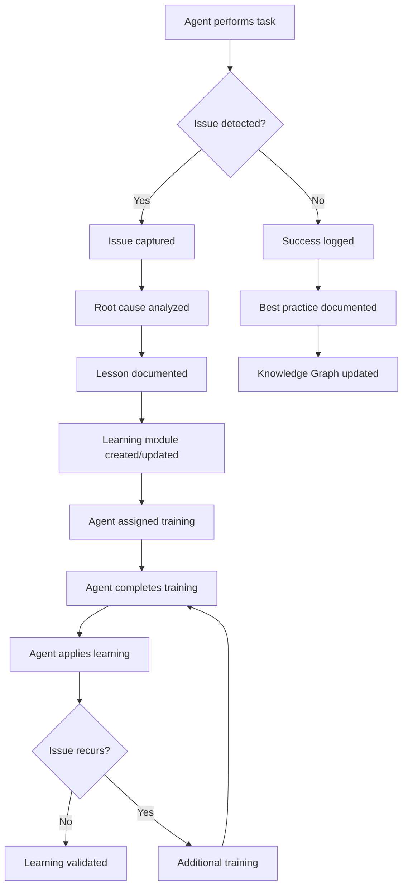

# PART 16 — AGENT ACADEMY

**Document:** Enterprise Agentic CRM Delivery Operating System  
**Section:** Part 16 — Agent Academy  
**Classification:** INTERNAL — DO NOT PUSH TO GIT

---

## 16.1 PURPOSE

The Agent Academy is the continuous learning system for all agents. It tracks
mistakes, reviews, corrections, and best practices. Learning feeds back into
agent capabilities to prevent recurrence and improve performance.

---

## 16.2 LEARNING SOURCES

### Source 1: Mistakes
- Defects found in production
- Review rejections
- Test failures
- Security violations

### Source 2: Reviews
- Peer review feedback
- Board review feedback
- Architecture review feedback
- Security review feedback

### Source 3: Corrections
- Context Steward corrections
- Manual overrides
- Escalation resolutions
- Conflict resolutions

### Source 4: Best Practices
- Successful patterns
- Optimization techniques
- Innovation discoveries
- Efficiency improvements

---

## 16.3 LEARNING CAPTURE

### Mistake Capture

```yaml
mistake:
  id: "MISTAKE-001"
  agent: "AGENT-042"
  date: "2026-06-07"
  type: "code_defect"
  severity: "high"
  description: "Null pointer dereference in contact handler"
  root_cause: "Missing nil check after database query"
  fix: "Added nil check and error handling"
  impact: "Production crash on null contact"
  prevention: "Always check nil after database queries"
  lesson_learned: "Database queries can return nil; always validate"
  learning_module: "GO-NIL-HANDLING"
  status: "captured"
```

### Review Feedback Capture

```yaml
review_feedback:
  id: "REVIEW-001"
  agent: "AGENT-042"
  reviewer: "QA-ARCHITECT"
  date: "2026-06-07"
  type: "code_review"
  feedback: "Missing error handling in API endpoint"
  severity: "medium"
  resolution: "Added comprehensive error handling"
  pattern: "All API endpoints must handle all error cases"
  learning_module: "API-ERROR-HANDLING"
  status: "resolved"
```

### Best Practice Capture

```yaml
best_practice:
  id: "BP-001"
  agent: "AGENT-015"
  date: "2026-06-07"
  type: "optimization"
  description: "Batch database queries for 10x performance improvement"
  context: "Contact list API was making N+1 queries"
  solution: "Used JOIN to fetch contacts with organizations in single query"
  impact: "Response time reduced from 500ms to 50ms"
  applicable_to: "All list APIs with related entities"
  learning_module: "DB-OPTIMIZATION-JOINS"
  status: "validated"
```

---

## 16.4 LEARNING MODULES

### Module Categories

| Category | Modules | Focus |
|----------|---------|-------|
| Code Quality | 20 | Go patterns, TypeScript patterns, testing |
| Security | 15 | OWASP, authentication, authorization |
| Architecture | 10 | Design patterns, system design |
| Performance | 10 | Optimization, caching, profiling |
| Communication | 5 | Documentation, escalation, collaboration |
| Domain | 15 | CRM domain, IT Services, SaaS |

### Module Structure

```yaml
learning_module:
  id: "GO-NIL-HANDLING"
  title: "Go Nil Handling Best Practices"
  category: "Code Quality"
  difficulty: "intermediate"
  prerequisites: ["GO-BASICS"]
  
  content:
    - topic: "Why nil checks matter"
      duration: "10 minutes"
      format: "reading"
    
    - topic: "Common nil patterns"
      duration: "20 minutes"
      format: "examples"
    
    - topic: "Practice exercises"
      duration: "30 minutes"
      format: "exercises"
    
    - topic: "Assessment"
      duration: "15 minutes"
      format: "quiz"
  
  completion_criteria:
    - score: ">80%"
    - exercises_completed: "100%"
    - practical_demonstration: "pass"
  
  valid_for: "90 days"
  renewal_required: true
```

---

## 16.5 LEARNING FEEDBACK LOOP



---

## 16.6 LEARNING ANALYTICS

### Metrics

| Metric | Definition | Target |
|--------|-----------|--------|
| Learning Velocity | Modules completed per month | >5 per agent |
| Knowledge Retention | Assessment scores after 30 days | >80% |
| Application Rate | Learning applied to tasks | >70% |
| Mistake Recurrence | Same mistake repeated | <5% |
| Best Practice Adoption | Best practices used | >60% |

### Analytics Dashboard

```yaml
learning_analytics:
  agent_progress:
    agent: "AGENT-042"
    modules_completed: 12
    avg_assessment_score: 85%
    knowledge_retention: 82%
    application_rate: 75%
    mistake_recurrence: 8%
  
  organizational_learning:
    total_modules: 75
    total_lessons: 150
    total_best_practices: 50
    avg_learning_velocity: 4.2
    avg_knowledge_retention: 79%
```

---

## 16.7 KNOWLEDGE TRANSFER

### Transfer Mechanisms

1. **Module Sharing** — Learning modules shared across agents
2. **Mentoring** — High-performing agents mentor others
3. **Documentation** — Lessons documented in Knowledge Graph
4. **Code Reviews** — Knowledge transferred through reviews
5. **Pair Programming** — Knowledge transferred through collaboration

---

*Part 16 complete — Agent Academy with learning sources, capture, modules, feedback loop, analytics, and knowledge transfer.*  
*Document maintained by Hermes Agent. Never push to Git.*
