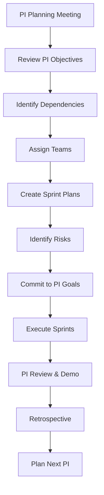
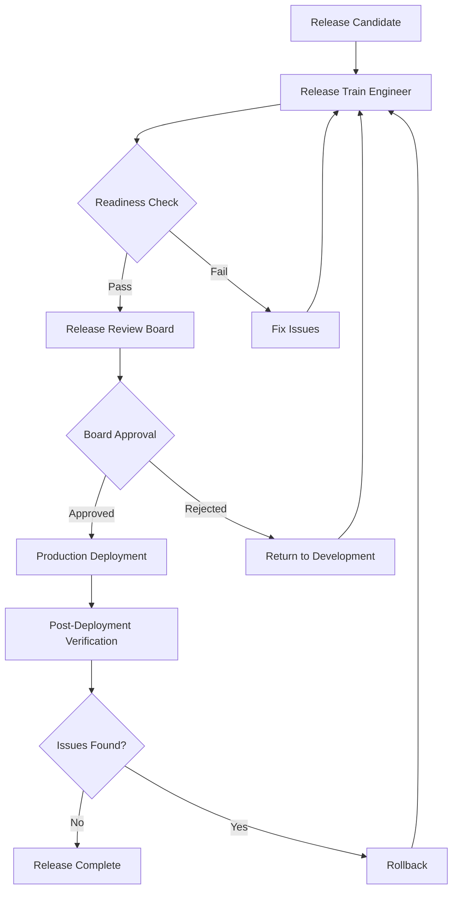

# PART 17 — RELEASE TRAIN ENGINEERING

**Document:** Enterprise Agentic CRM Delivery Operating System  
**Section:** Part 17 — Release Train Engineering  
**Classification:** INTERNAL — DO NOT PUSH TO GIT

---

## 17.1 PURPOSE

The Release Train Engineer Agent coordinates sprint alignment, program
increments, dependency coordination, and release readiness across all teams.

---

## 17.2 RELEASE TRAIN ENGINEER AGENT

**Mission:** Coordinate release planning and execution across all teams
**Tier:** 2 — Director
**Reports To:** COO Agent

**Responsibilities:**
- Coordinate sprint planning across teams
- Manage program increments
- Resolve cross-team dependencies
- Track release readiness
- Coordinate release activities
- Manage rollback procedures
- Track release metrics

**Tool Access:**
- Project management tools
- Dependency tracking tools
- Release management tools
- Monitoring tools

**Authority Limits:**
- Can delay releases for readiness issues
- Requires COO approval for emergency releases
- Cannot override security gates

---

## 17.3 SPRINT ALIGNMENT

### Program Increment (PI) Structure

```
┌─────────────────────────────────────────────────────────────┐
│              PROGRAM INCREMENT (8 weeks)                     │
├─────────────────────────────────────────────────────────────┤
│                                                             │
│  SPRINT 1 (2 weeks)                                        │
│  ├── Planning                                               │
│  ├── Implementation                                         │
│  ├── Testing                                                │
│  └── Review                                                 │
│                                                             │
│  SPRINT 2 (2 weeks)                                        │
│  ├── Planning                                               │
│  ├── Implementation                                         │
│  ├── Testing                                                │
│  └── Review                                                 │
│                                                             │
│  SPRINT 3 (2 weeks)                                        │
│  ├── Planning                                               │
│  ├── Implementation                                         │
│  ├── Testing                                                │
│  └── Review                                                 │
│                                                             │
│  SPRINT 4 (2 weeks)                                        │
│  ├── Planning                                               │
│  ├── Implementation                                         │
│  ├── Integration Testing                                   │
│  ├── Performance Testing                                   │
│  ├── Security Testing                                      │
│  └── PI Review & Demo                                       │
│                                                             │
└─────────────────────────────────────────────────────────────┘
```

### PI Planning Process



---

## 17.4 DEPENDENCY COORDINATION

### Dependency Types

| Type | Description | Management |
|------|-------------|------------|
| Feature | Feature A needed for Feature B | Sprint alignment |
| Technical | Service A needed for Service B | API contracts |
| Data | Data from System A needed for System B | Data pipelines |
| Resource | Same resource needed by multiple teams | Resource scheduling |

### Coordination Process

1. **Identify** — Teams identify dependencies during PI planning
2. **Document** — Dependencies documented in Knowledge Graph
3. **Track** — Dependencies tracked weekly
4. **Resolve** — Conflicts escalated to Release Train Engineer
5. **Verify** — Dependencies verified before sprint completion

---

## 17.5 RELEASE READINESS

### Readiness Checklist

```yaml
release_readiness:
  code_quality:
    - unit_tests_passing: true
    - integration_tests_passing: true
    - e2e_tests_passing: true
    - code_coverage_above_80: true
    - lint_warnings_zero: true
    - type_errors_zero: true
  
  security:
    - sast_scan_clean: true
    - dast_scan_clean: true
    - dependency_scan_clean: true
    - container_scan_clean: true
    - penetration_test_pass: true
  
  performance:
    - load_test_pass: true
    - stress_test_pass: true
    - performance_baseline_met: true
  
  documentation:
    - api_docs_updated: true
    - user_guide_updated: true
    - release_notes_complete: true
    - changelog_updated: true
  
  operations:
    - monitoring_configured: true
    - alerts_configured: true
    - rollback_plan_ready: true
    - runbook_updated: true
  
  governance:
    - all_reviews_approved: true
    - all_adrs_updated: true
    - all_knowledge_graph_updated: true
```

### Release Approval Process



---

## 17.6 RELEASE METRICS

| Metric | Target | Measurement |
|--------|--------|-------------|
| Release Frequency | Bi-weekly | Releases per month |
| Lead Time | <2 weeks | Time from code commit to production |
| Deployment Frequency | Weekly | Deployments per week |
| Change Failure Rate | <5% | % releases causing issues |
| Mean Time to Recovery | <30 minutes | Time to recover from failure |
| Rollback Rate | <2% | % releases rolled back |

---

## 17.7 RELEASE CALENDAR

### Release Schedule

| Release | Sprint | Target Date | Features |
|---------|--------|-------------|----------|
| v0.1.0 | Sprint 1 | Week 2 | Core CRM, Contacts |
| v0.2.0 | Sprint 2 | Week 4 | Organizations, Deals |
| v0.3.0 | Sprint 3 | Week 6 | Workflows, Automation |
| v0.4.0 | Sprint 4 | Week 8 | AI Features, Analytics |
| v1.0.0 | PI End | Week 8 | Production Release |

---

*Part 17 complete — Release Train Engineering with PI structure, dependency coordination, release readiness, and metrics.*  
*Document maintained by Hermes Agent. Never push to Git.*
