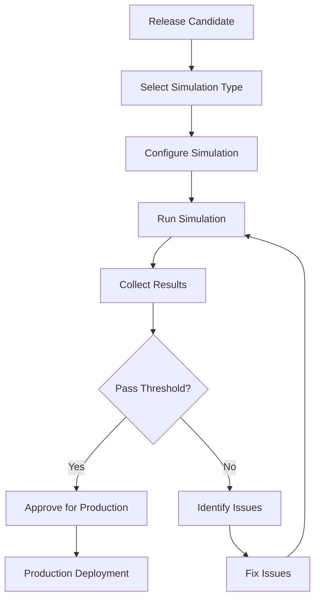

# PART 18 — DIGITAL TWIN ENVIRONMENT

**Document:** Enterprise Agentic CRM Delivery Operating System  
**Section:** Part 18 — Digital Twin Environment  
**Classification:** INTERNAL — DO NOT PUSH TO GIT

---

## 18.1 PURPOSE

The Digital Twin Environment is a simulation layer that mirrors production.
No major release enters production without simulation. It validates architecture,
features, AI agents, migrations, and load behavior before production deployment.

---

## 18.2 SIMULATION CAPABILITIES

### Capability 1: Architecture Simulation

**Purpose:** Validate architectural decisions before implementation
**Agents:** Enterprise Architect, Solution Architect

**Simulations:**
- System behavior under different architectures
- Component interaction patterns
- Data flow validation
- Integration point verification

**Tools:**
- Architecture modeling tools
- Simulation engines
- Behavior modeling

**Output:**
- Architecture validation report
- Performance predictions
- Risk assessment

### Capability 2: Feature Simulation

**Purpose:** Validate feature behavior before full implementation
**Agents:** Product Management Agent, QA Architect

**Simulations:**
- User workflow validation
- Feature interaction testing
- Edge case simulation
- Error scenario simulation

**Tools:**
- Prototype tools
- Mock services
- Test harnesses

**Output:**
- Feature validation report
- User experience assessment
- Risk assessment

### Capability 3: AI Agent Simulation

**Purpose:** Validate AI behavior before production deployment
**Agents:** AI Architect, AI Engineer

**Simulations:**
- Prompt response validation
- Hallucination detection testing
- Bias testing
- Cost simulation
- Latency simulation

**Tools:**
- LLM simulation environments
- Mock LLM services
- Cost tracking tools

**Output:**
- AI behavior report
- Cost projection
- Risk assessment

### Capability 4: Migration Simulation

**Purpose:** Validate data migrations before execution
**Agents:** Data Architect, CRM Data Specialist

**Simulations:**
- Data transformation validation
- Data integrity verification
- Performance impact assessment
- Rollback testing

**Tools:**
- Migration simulation tools
- Data validation tools
- Performance testing tools

**Output:**
- Migration validation report
- Data integrity report
- Risk assessment

### Capability 5: Load Simulation

**Purpose:** Validate system behavior under load
**Agents:** Performance Testing Agent, SRE Agent

**Simulations:**
- Concurrent user simulation
- Throughput testing
- Resource utilization testing
- Breaking point identification

**Tools:**
- k6
- Locust
- Custom load generators

**Output:**
- Performance report
- Capacity plan
- Risk assessment

---

## 18.3 SIMULATION ENVIRONMENT

### Environment Architecture

```
┌─────────────────────────────────────────────────────────────┐
│                 DIGITAL TWIN ENVIRONMENT                     │
├─────────────────────────────────────────────────────────────┤
│                                                             │
│  ┌─────────────────────────────────────────────────────┐   │
│  │                    SIMULATION LAYER                   │   │
│  │  ┌──────────┐ ┌──────────┐ ┌──────────┐            │   │
│  │  │ Arch Sim │ │ Feature  │ │ AI Agent │            │   │
│  │  │          │ │ Sim      │ │ Sim      │            │   │
│  │  └──────────┘ └──────────┘ └──────────┘            │   │
│  │  ┌──────────┐ ┌──────────┐                          │   │
│  │  │ Migration│ │ Load Sim │                          │   │
│  │  │ Sim      │ │          │                          │   │
│  │  └──────────┘ └──────────┘                          │   │
│  └─────────────────────────────────────────────────────┘   │
│                           │                                 │
│  ┌─────────────────────────────────────────────────────┐   │
│  │                  MOCK SERVICES                       │   │
│  │  ┌──────────┐ ┌──────────┐ ┌──────────┐            │   │
│  │  │ Mock API │ │ Mock DB  │ │ Mock AI  │            │   │
│  │  │          │ │          │ │          │            │   │
│  │  └──────────┘ └──────────┘ └──────────┘            │   │
│  └─────────────────────────────────────────────────────┘   │
│                           │                                 │
│  ┌─────────────────────────────────────────────────────┐   │
│  │                  TEST DATA                           │   │
│  │  ┌──────────┐ ┌──────────┐ ┌──────────┐            │   │
│  │  │ Synthetic│ │ Anonymized│ │ Generated│            │   │
│  │  │ Data     │ │ Production│ │ Stress   │            │   │
│  │  └──────────┘ └──────────┘ └──────────┘            │   │
│  └─────────────────────────────────────────────────────┘   │
│                                                             │
└─────────────────────────────────────────────────────────────┘
```

---

## 18.4 SIMULATION WORKFLOW



---

## 18.5 SIMULATION GATES

### Gate 1: Architecture Gate
- Architecture simulation must pass before implementation
- Performance predictions within acceptable range
- No critical architecture risks identified

### Gate 2: Feature Gate
- Feature simulation must pass before full implementation
- User workflows validated
- Edge cases covered

### Gate 3: AI Gate
- AI simulation must pass before production deployment
- Hallucination rate within threshold
- Cost within budget
- Latency within requirements

### Gate 4: Migration Gate
- Migration simulation must pass before execution
- Data integrity verified
- Rollback tested

### Gate 5: Load Gate
- Load simulation must pass before production
- Performance targets met
- Breaking point documented

---

## 18.6 SIMULATION METRICS

| Metric | Target | Measurement |
|--------|--------|-------------|
| Simulation Coverage | 100% | % of major releases simulated |
| Simulation Accuracy | >90% | % of predictions matching reality |
| False Positive Rate | <10% | % of simulations that failed but production passed |
| False Negative Rate | <5% | % of simulations that passed but production failed |
| Simulation Time | <2 hours | Average time per simulation |

---

*Part 18 complete — Digital Twin Environment with 5 simulation capabilities, environment architecture, workflow, and gates.*  
*Document maintained by Hermes Agent. Never push to Git.*
