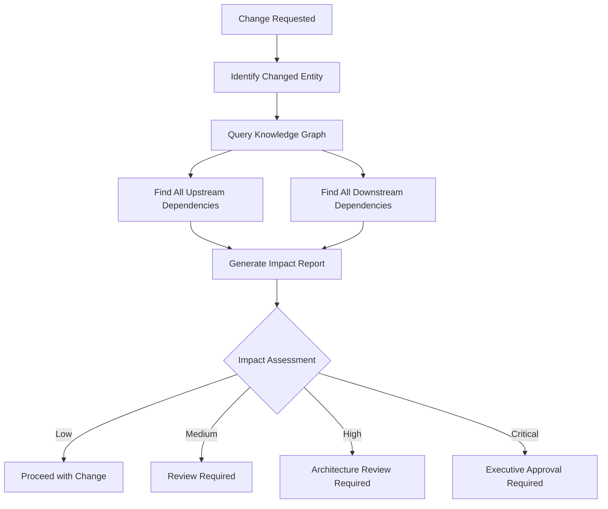

# PART 14 — DEPENDENCY INTELLIGENCE ENGINE

**Document:** Enterprise Agentic CRM Delivery Operating System  
**Section:** Part 14 — Dependency Intelligence Engine  
**Classification:** INTERNAL — DO NOT PUSH TO GIT

---

## 14.1 PURPOSE

The Dependency Intelligence Engine maps every feature to its complete
dependency chain: Feature → Workflow → API → Service → Database → Dashboard
→ Permission → Deployment. Before any change, impact analysis is run.

---

## 14.2 DEPENDENCY MAP

### Chain Structure

```
┌─────────────────────────────────────────────────────────────┐
│                    DEPENDENCY CHAIN                          │
├─────────────────────────────────────────────────────────────┤
│                                                             │
│  FEATURE                                                    │
│  └── WORKFLOW                                               │
│      └── TRIGGER                                            │
│          └── ACTION                                         │
│              └── API ENDPOINT                               │
│                  └── HANDLER                                │
│                      └── SERVICE                            │
│                          └── REPOSITORY                     │
│                              └── DATABASE TABLE             │
│                                  └── COLUMN                 │
│                                      └── INDEX              │
│                                          └── MIGRATION      │
│                                                             
│  FEATURE                                                    │
│  └── UI COMPONENT                                           │
│      └── PAGE                                               │
│          └── ROUTE                                          │
│              └── API CALL                                   │
│                  └── ENDPOINT                               │
│                      └── PERMISSION                         │
│                          └── ROLE                           │
│                              └── POLICY                     │
│                                                             
│  FEATURE                                                    │
│  └── DEPLOYMENT                                             │
│      └── SERVICE                                            │
│          └── CONTAINER                                      │
│              └── CONFIGURATION                              │
│                  └── ENVIRONMENT                            │
│                      └── MONITORING                         │
│                          └── ALERT                          │
│                                                             │
└─────────────────────────────────────────────────────────────┘
```

### Entity Types in Chain

| Entity | Description | Example |
|--------|-------------|---------|
| Feature | User-facing capability | Contact Management |
| Workflow | Business process | Auto-assign contacts |
| Trigger | Event that starts workflow | New contact created |
| Action | Step in workflow | Send welcome email |
| API Endpoint | HTTP endpoint | POST /contacts |
| Handler | Go handler function | HandleCreateContact |
| Service | Business logic layer | ContactService |
| Repository | Data access layer | ContactRepository |
| Database Table | PostgreSQL table | contacts |
| Column | Table column | email |
| Index | Database index | idx_contacts_email |
| Migration | Schema migration | 009_rls_multi_tenancy.sql |
| UI Component | React component | ContactForm |
| Page | React page | /contacts/new |
| Route | Next.js route | /api/contacts |
| Permission | Access control | contacts.create |
| Role | User role | admin |
| Policy | Security policy | RLS policy |
| Deployment | Deployment unit | production-api |
| Container | Podman container | sovereign-api |
| Configuration | Config file | .env.production |
| Environment | Runtime env | production |
| Monitoring | Monitoring rule | API latency alert |
| Alert | Alert rule | High error rate |

---

## 14.3 IMPACT ANALYSIS

### Analysis Process



### Impact Categories

| Category | Description | Example |
|----------|-------------|---------|
| Direct | Immediate dependency | Changing contact email field |
| Indirect | Dependency through chain | Changing contact affects deals |
| Cascading | Multiple downstream effects | Changing auth affects all endpoints |
| Lateral | Cross-module impact | Changing contacts affects organizations |

### Impact Scoring

```python
def calculate_impact_score(change):
    # Factor 1: Number of downstream dependencies
    downstream_count = count_downstream_dependencies(change.entity)
    downstream_score = min(downstream_count * 10, 100)
    
    # Factor 2: Criticality of affected entities
    criticality_score = sum(
        entity.criticality for entity in get_affected_entities(change)
    ) / len(get_affected_entities(change))
    
    # Factor 3: Number of affected agents
    affected_agents = count_affected_agents(change)
    agent_score = min(affected_agents * 5, 100)
    
    # Factor 4: Risk of change
    risk_score = change.risk_level * 20
    
    # Calculate total score
    impact_score = (
        downstream_score * 0.3 +
        criticality_score * 0.3 +
        agent_score * 0.2 +
        risk_score * 0.2
    )
    
    return impact_score

def get_impact_level(score):
    if score < 20:
        return "LOW"
    elif score < 50:
        return "MEDIUM"
    elif score < 80:
        return "HIGH"
    else:
        return "CRITICAL"
```

---

## 14.4 CHANGE VALIDATION RULES

### Rule 1: Pre-Change Validation
Before any change:
1. Identify all affected entities
2. Run impact analysis
3. Check for conflicts
4. Verify authorization
5. Document change

### Rule 2: Post-Change Validation
After any change:
1. Update Knowledge Graph
2. Verify dependent entities
3. Run regression tests
4. Notify affected agents
5. Update documentation

### Rule 3: Dependency Validation
For dependency changes:
1. Verify no circular dependencies
2. Verify version compatibility
3. Verify integration points
4. Verify performance impact
5. Verify security impact

---

## 14.5 DEPENDENCY VISUALIZATION

### Dependency Graph Query

```cypher
// Find all dependencies for a feature
MATCH (f:Feature {id: 'FEAT-001'})-[:DEPENDS_ON*]->(dep)
RETURN f, dep

// Find all entities affected by a change
MATCH (e:Entity {id: 'ENT-001'})<-[:DEPENDS_ON*]-(affected)
RETURN e, affected

// Find critical path
MATCH path = shortestPath(
    (start:Feature {id: 'FEAT-001'})-[:DEPENDS_ON*]->(end:Deployment {id: 'DEPLOY-001'})
)
RETURN path
```

### Impact Report Template

```markdown
# Impact Analysis Report

**Change:** {Description}
**Entity:** {Entity ID}
**Requested By:** {Agent}
**Date:** {Date}

## Direct Impact
- {Entity 1}: {Impact description}
- {Entity 2}: {Impact description}

## Indirect Impact
- {Entity 3}: {Impact through Entity 1}
- {Entity 4}: {Impact through Entity 2}

## Cascading Impact
- {Entity 5}: {Cascading effect}
- {Entity 6}: {Cascading effect}

## Affected Agents
- {Agent 1}: {Why affected}
- {Agent 2}: {Why affected}

## Required Actions
1. {Action 1}
2. {Action 2}
3. {Action 3}

## Risk Assessment
- Risk Level: {Low/Medium/High/Critical}
- Mitigation: {Mitigation plan}

## Approval Required
- [ ] {Approver 1}
- [ ] {Approver 2}
```

---

*Part 14 complete — Dependency Intelligence Engine with chain mapping, impact analysis, scoring, and validation rules.*  
*Document maintained by Hermes Agent. Never push to Git.*
