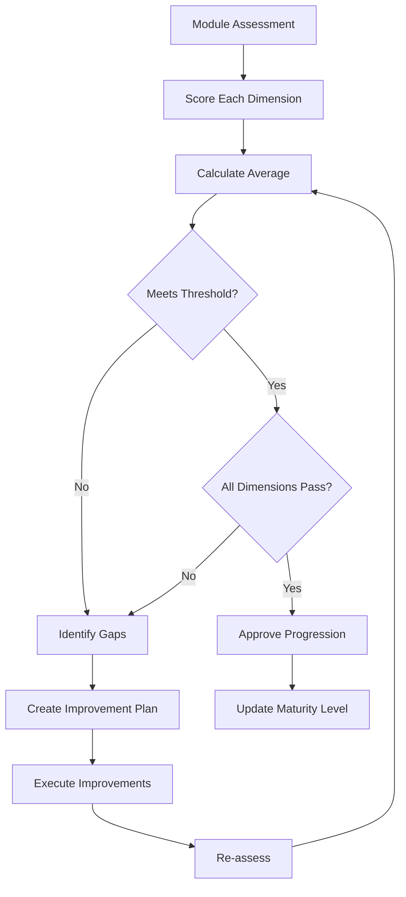

# PART 23 — ENTERPRISE MATURITY MODEL

**Document:** Enterprise Agentic CRM Delivery Operating System  
**Section:** Part 23 — Enterprise Maturity Model  
**Classification:** INTERNAL — DO NOT PUSH TO GIT

---

## 23.1 PURPOSE

Score every CRM module across 8 dimensions (Product, Architecture, Security,
Data, QA, Scalability, Operations, AI Readiness) on a 0-5 scale. No module
progresses until minimum thresholds are achieved.

---

## 23.2 MATURITY DIMENSIONS

### Dimension 1: Product Maturity

| Level | Description |
|-------|-------------|
| 0 | Not started |
| 1 | Requirements defined |
| 2 | Design completed |
| 3 | MVP implemented |
| 4 | Fully featured |
| 5 | Optimized and refined |

### Dimension 2: Architecture Maturity

| Level | Description |
|-------|-------------|
| 0 | Not started |
| 1 | Basic structure |
| 2 | Patterns established |
| 3 | Fully designed |
| 4 | Reviewed and approved |
| 5 | Optimized and documented |

### Dimension 3: Security Maturity

| Level | Description |
|-------|-------------|
| 0 | Not started |
| 1 | Basic auth implemented |
| 2 | Authorization implemented |
| 3 | Security review passed |
| 4 | Penetration test passed |
| 5 | Compliance certified |

### Dimension 4: Data Maturity

| Level | Description |
|-------|-------------|
| 0 | Not started |
| 1 | Schema designed |
| 2 | Migrations implemented |
| 3 | RLS implemented |
| 4 | Data quality rules active |
| 5 | Data governance complete |

### Dimension 5: QA Maturity

| Level | Description |
|-------|-------------|
| 0 | Not started |
| 1 | Unit tests written |
| 2 | Integration tests written |
| 3 | E2E tests written |
| 4 | Performance tests written |
| 5 | Full test coverage |

### Dimension 6: Scalability Maturity

| Level | Description |
|-------|-------------|
| 0 | Not tested |
| 1 | Basic load tested |
| 2 | Scaling strategy defined |
| 3 | Horizontal scaling implemented |
| 4 | Load balanced |
| 5 | Auto-scaling configured |

### Dimension 7: Operations Maturity

| Level | Description |
|-------|-------------|
| 0 | Not deployed |
| 1 | Manual deployment |
| 2 | CI/CD pipeline |
| 3 | Monitoring configured |
| 4 | Alerting configured |
| 5 | Full observability |

### Dimension 8: AI Readiness Maturity

| Level | Description |
|-------|-------------|
| 0 | Not started |
| 1 | AI features designed |
| 2 | Basic AI implemented |
| 3 | AI governance applied |
| 4 | AI testing complete |
| 5 | AI optimized |

---

## 23.3 MODULE MATURITY SCORES

### Contact Management

| Dimension | Score | Status |
|-----------|-------|--------|
| Product | 4 | Complete |
| Architecture | 4 | Complete |
| Security | 3 | In Progress |
| Data | 4 | Complete |
| QA | 3 | In Progress |
| Scalability | 3 | In Progress |
| Operations | 3 | In Progress |
| AI Readiness | 2 | In Progress |
| **Average** | **3.25** | |

### Organization Management

| Dimension | Score | Status |
|-----------|-------|--------|
| Product | 4 | Complete |
| Architecture | 4 | Complete |
| Security | 3 | In Progress |
| Data | 4 | Complete |
| QA | 3 | In Progress |
| Scalability | 3 | In Progress |
| Operations | 3 | In Progress |
| AI Readiness | 2 | In Progress |
| **Average** | **3.25** | |

### Deal Management

| Dimension | Score | Status |
|-----------|-------|--------|
| Product | 3 | In Progress |
| Architecture | 3 | In Progress |
| Security | 3 | In Progress |
| Data | 3 | In Progress |
| QA | 3 | In Progress |
| Scalability | 3 | In Progress |
| Operations | 3 | In Progress |
| AI Readiness | 2 | In Progress |
| **Average** | **2.88** | |

### Workflow Automation

| Dimension | Score | Status |
|-----------|-------|--------|
| Product | 3 | In Progress |
| Architecture | 3 | In Progress |
| Security | 3 | In Progress |
| Data | 3 | In Progress |
| QA | 3 | In Progress |
| Scalability | 3 | In Progress |
| Operations | 3 | In Progress |
| AI Readiness | 2 | In Progress |
| **Average** | **2.88** | |

---

## 23.4 THRESHOLD REQUIREMENTS

### Minimum Thresholds for Progression

| Level | Minimum Score | Required Dimensions |
|-------|--------------|---------------------|
| Level 1 → 2 | >1.0 average | All dimensions >0 |
| Level 2 → 3 | >2.0 average | All dimensions >1 |
| Level 3 → 4 | >3.0 average | All dimensions >2 |
| Level 4 → 5 | >4.0 average | All dimensions >3 |

### Blocking Rules

1. **Security Block** — Security score <3 blocks progression to Level 4
2. **QA Block** — QA score <3 blocks progression to Level 4
3. **Data Block** — Data score <3 blocks progression to Level 4
4. **Operations Block** — Operations score <3 blocks progression to Level 4

---

## 23.5 MATURITY ASSESSMENT PROCESS

---

*Part 23 complete — Enterprise Maturity Model with 8 dimensions, scoring, thresholds, and progression rules.*  
*Document maintained by Hermes Agent. Never push to Git.*
