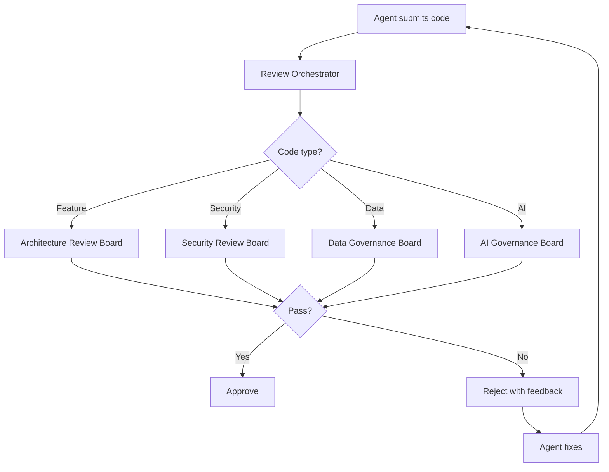
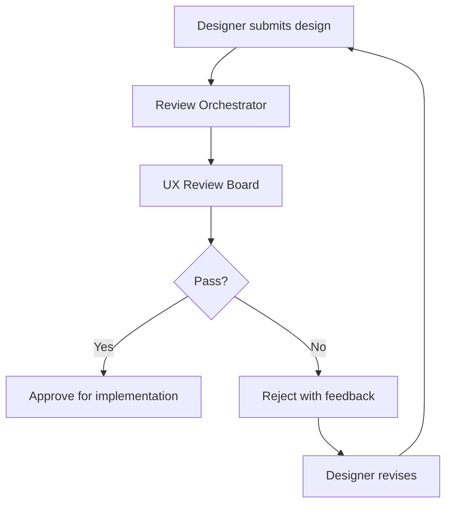
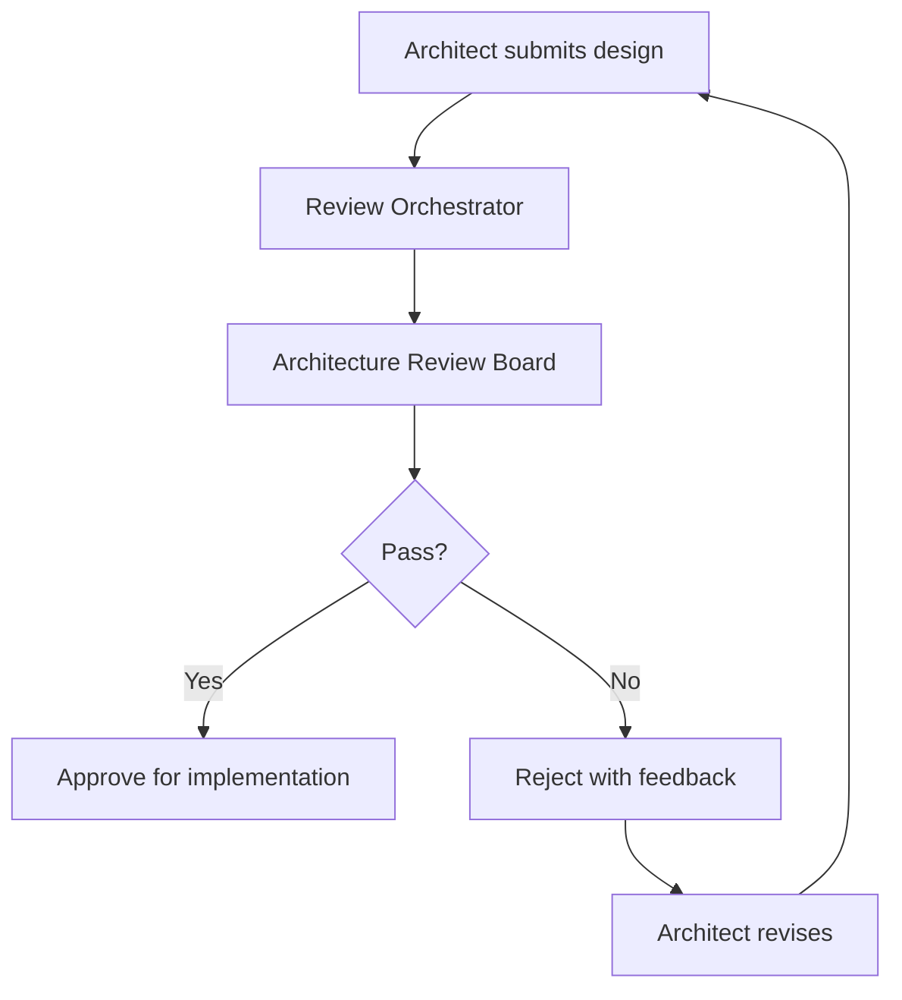

# PART 7 — REVIEW BOARD SYSTEM

**Document:** Enterprise Agentic CRM Delivery Operating System  
**Section:** Part 7 — Review Board System  
**Classification:** INTERNAL — DO NOT PUSH TO GIT

---

## 7.1 PURPOSE

Independent review boards ensure no agent approves its own work. Every
significant deliverable passes through independent review before proceeding.
This is a hard governance control — not optional.

---

## 7.2 REVIEW BOARDS

### Board 1: Product Review Board

**Chair:** CPO Agent
**Members:** Product Management Agent, UX Research Agent, User Research Agent
**Scope:** Product requirements, feature specifications, user stories
**Meeting:** Weekly or as needed

**Review Criteria:**
- [ ] Requirements are clear and unambiguous
- [ ] Acceptance criteria are testable
- [ ] User value is clearly articulated
- [ ] Business value is quantified
- [ ] Dependencies are identified
- [ ] Risks are documented
- [ ] Persona alignment is confirmed
- [ ] Journey impact is assessed

**Approval Process:**
1. Product Management Agent submits requirement/feature
2. Board reviews within 48 hours
3. Board approves, rejects, or requests changes
4. If approved, proceed to Architecture Review Board
5. If rejected, return to Product Management with feedback

**Voting Rules:**
- Simple majority (2/3) required for approval
- Chair has tie-breaking vote
- Unanimous required for P0 features

### Board 2: Architecture Review Board

**Chair:** CTO Agent
**Members:** Enterprise Architect, Solution Architect, Security Architect
**Scope:** Architecture designs, ADRs, technology selections
**Meeting:** Weekly or as needed

**Review Criteria:**
- [ ] Aligns with enterprise architecture standards
- [ ] Meets performance requirements
- [ ] Meets security requirements
- [ ] Meets scalability requirements
- [ ] Integrates with existing architecture
- [ ] ADR is complete and well-reasoned
- [ ] Alternatives are properly evaluated
- [ ] Risks are identified and mitigated

**Approval Process:**
1. Solution Architect submits architecture design/ADR
2. Board reviews within 72 hours
3. Board approves, rejects, or requests changes
4. If approved, proceed to implementation
5. If rejected, return with feedback

**Voting Rules:**
- Unanimous required for critical architecture decisions
- Simple majority for non-critical decisions
- Security Architect has veto on security matters

### Board 3: Security Review Board

**Chair:** CSO Agent
**Members:** Security Architect, Security Operations Agent, Privacy Agent
**Scope:** Security designs, threat models, security assessments
**Meeting:** Weekly or as needed

**Review Criteria:**
- [ ] Threat model is complete
- [ ] Security controls are adequate
- [ ] Compliance requirements are met
- [ ] Data privacy is protected
- [ ] Authentication/authorization is correct
- [ ] Encryption is properly implemented
- [ ] Audit logging is comprehensive
- [ ] Incident response plan is current

**Approval Process:**
1. Security Architect submits security design/assessment
2. Board reviews within 48 hours
3. Board approves, rejects, or requests changes
4. If approved, proceed to implementation
5. If rejected, return with mandatory fixes

**Voting Rules:**
- Unanimous required for security-critical decisions
- Security Architect has absolute veto on security matters
- No bypass allowed for security gates

### Board 4: Data Governance Board

**Chair:** CDO Agent
**Members:** Data Architect, Data Steward Agent, Privacy Agent
**Scope:** Data models, data policies, data quality
**Meeting:** Bi-weekly or as needed

**Review Criteria:**
- [ ] Data model is normalized and efficient
- [ ] Data quality rules are defined
- [ ] Privacy requirements are met
- [ ] Retention policies are defined
- [ ] Lineage is documented
- [ ] Master data is managed
- [ ] Metadata is complete
- [ ] Compliance is maintained

**Approval Process:**
1. Data Architect submits data design/policy
2. Board reviews within 72 hours
3. Board approves, rejects, or requests changes
4. If approved, proceed to implementation
5. If rejected, return with feedback

**Voting Rules:**
- Simple majority required
- CDO has tie-breaking vote
- Privacy Agent has veto on privacy matters

### Board 5: UX Review Board

**Chair:** CPO Agent
**Members:** UX Design Agent, UI Design Agent, Accessibility Agent, Design QA Agent
**Scope:** UX designs, UI designs, accessibility compliance
**Meeting:** Weekly or as needed

**Review Criteria:**
- [ ] Design follows design system
- [ ] Accessibility standards are met (WCAG 2.1 AA)
- [ ] User flows are intuitive
- [ ] Visual design is consistent
- [ ] Responsive design is implemented
- [ ] Loading states are handled
- [ ] Error states are handled
- [ ] Empty states are handled

**Approval Process:**
1. UI Design Agent submits design
2. Board reviews within 48 hours
3. Board approves, rejects, or requests changes
4. If approved, proceed to implementation
5. If rejected, return with feedback

**Voting Rules:**
- Simple majority required
- Accessibility Agent has veto on accessibility matters
- Design QA Agent confirms implementation accuracy

### Board 6: AI Governance Board

**Chair:** AI Architect
**Members:** AI Ethics Agent, Hallucination Detection Agent, Prompt Risk Agent
**Scope:** AI features, prompt designs, agent behaviors
**Meeting:** Weekly or as needed

**Review Criteria:**
- [ ] AI behavior is predictable and safe
- [ ] Hallucination risks are mitigated
- [ ] Data leakage is prevented
- [ ] Ethical guidelines are followed
- [ ] Prompt injection is prevented
- [ ] Bias is tested and mitigated
- [ ] Cost is within budget
- [ ] Performance meets requirements

**Approval Process:**
1. AI Engineer submits AI feature/prompt
2. Board reviews within 72 hours
3. Board approves, rejects, or requests changes
4. If approved, proceed to implementation
5. If rejected, return with mandatory fixes

**Voting Rules:**
- Unanimous required for AI-critical decisions
- AI Ethics Agent has absolute veto on ethical matters
- No bypass allowed for AI governance gates

### Board 7: Release Review Board

**Chair:** COO Agent
**Members:** CTO Agent, CPO Agent, CSO Agent, SRE Agent
**Scope:** Production releases, deployment approvals, rollback decisions
**Meeting:** As needed for releases

**Review Criteria:**
- [ ] All quality gates passed
- [ ] All security gates passed
- [ ] Performance benchmarks met
- [ ] Rollback plan is ready
- [ ] Monitoring is configured
- [ ] Documentation is updated
- [ ] Release notes are complete
- [ ] Stakeholders are notified

**Approval Process:**
1. Release Orchestrator submits release candidate
2. Board reviews within 24 hours
3. Board approves, rejects, or delays
4. If approved, proceed to deployment
5. If rejected, return with mandatory fixes

**Voting Rules:**
- Unanimous required for production deployment
- CSO has veto on security matters
- CTO has veto on technical matters
- No bypass allowed for production gates

---

## 7.3 REVIEW PROCESS FLOWS

### Code Review Flow

### Design Review Flow

### Architecture Review Flow

---

## 7.4 ESCALATION FROM REVIEW BOARDS

### Escalation Triggers

| Trigger | Escalation Target | Response Time |
|---------|-------------------|---------------|
| Board cannot reach consensus | Executive Council | 24 hours |
| Critical security issue | CSO Agent | Immediate |
| Critical architecture issue | CTO Agent | 4 hours |
| Critical product issue | CPO Agent | 4 hours |
| Compliance violation | Legal Compliance Agent | 24 hours |

### Escalation Process

1. Board identifies escalation need
2. Board Chair documents escalation
3. Escalation sent to target
4. Target responds within response time
5. Decision documented in ADR
6. Decision communicated to all affected agents

---

## 7.5 REVIEW METRICS

| Metric | Target | Measurement |
|--------|--------|-------------|
| Review Turnaround Time | <48 hours | Average time from submission to decision |
| First-Pass Approval Rate | >70% | % of submissions approved on first review |
| Defect Escape Rate | <5% | % of defects found after review |
| Review Coverage | 100% | % of deliverables reviewed |
| Review Quality | >4.0/5.0 | Average review quality score |

---

*Part 7 complete — 7 review boards defined with criteria, processes, voting rules, and escalation paths.*  
*Document maintained by Hermes Agent. Never push to Git.*
