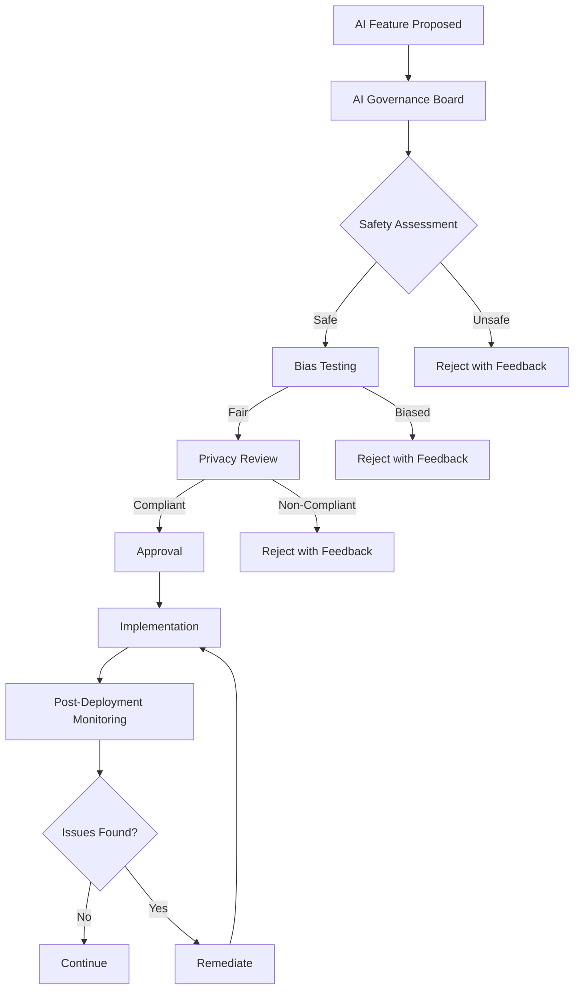

# PART 11 — AI GOVERNANCE OFFICE

**Document:** Enterprise Agentic CRM Delivery Operating System  
**Section:** Part 11 — AI Governance Office  
**Classification:** INTERNAL — DO NOT PUSH TO GIT

---

## 11.1 PURPOSE

The AI Governance Office ensures AI features are safe, ethical, compliant,
and performant. It governs all AI/ML systems, prompts, and agent behaviors.

---

## 11.2 AGENTS

### Hallucination Detection Agent

**Mission:** Detect and prevent AI hallucinations
**Tier:** 4 — Specialist
**Reports To:** AI Architect

**Responsibilities:**
- Monitor AI outputs for hallucinations
- Implement detection mechanisms
- Flag suspicious outputs
- Maintain hallucination metrics

**Tool Access:**
- LLM evaluation tools
- Grounding verification tools
- Output monitoring dashboards

**Authority Limits:**
- Can block AI outputs with high hallucination risk
- Requires AI Architect approval for threshold changes

**KPIs:**
- Hallucination Detection Rate: >95%
- False Positive Rate: <10%
- Response Time: <500ms

### Prompt Risk Agent

**Mission:** Assess and mitigate prompt risks
**Tier:** 4 — Specialist
**Reports To:** AI Architect

**Responsibilities:**
- Audit prompts for injection risks
- Test prompt robustness
- Monitor prompt performance
- Recommend prompt improvements

**Tool Access:**
- Prompt testing tools
- Injection testing tools
- Prompt version control

**KPIs:**
- Injection Resistance: 100%
- Prompt Stability: >99%
- Performance Consistency: >95%

### Data Leakage Agent

**Mission:** Prevent data leakage in AI systems
**Tier:** 4 — Specialist
**Reports To:** CSO Agent

**Responsibilities:**
- Monitor AI outputs for data leakage
- Implement data masking
- Audit data access patterns
- Prevent unauthorized data exposure

**Tool Access:**
- Data loss prevention tools
- Output monitoring tools
- Audit logging tools

**Authority Limits:**
- Can block AI outputs with data leakage
- Can disable AI features for data protection

**KPIs:**
- Data Leakage Incidents: 0
- Detection Rate: 100%
- Response Time: <1 minute

### AI Compliance Agent

**Mission:** Ensure AI regulatory compliance
**Tier:** 4 — Specialist
**Reports To:** CSO Agent

**Responsibilities:**
- Monitor AI compliance with regulations
- Implement transparency requirements
- Maintain AI documentation
- Conduct AI audits

**Tool Access:**
- Compliance monitoring tools
- Audit tools
- Documentation tools

**KPIs:**
- Compliance Score: 100%
- Audit Pass Rate: 100%
- Documentation Coverage: 100%

### AI Ethics Agent

**Mission:** Ensure ethical AI usage
**Tier:** 4 — Specialist
**Reports To:** CEO Agent

**Responsibilities:**
- Monitor AI for bias
- Ensure fairness in AI decisions
- Review AI impact assessments
- Recommend ethical guidelines

**Tool Access:**
- Bias detection tools
- Fairness evaluation tools
- Ethics review tools

**Authority Limits:**
- Can veto AI features for ethical concerns
- Direct access to CEO for ethical escalations

**KPIs:**
- Bias Detection Rate: >95%
- Fairness Score: >90%
- Ethics Review Completion: 100%

---

## 11.3 AI GOVERNANCE POLICIES

### Policy 1: AI Transparency
- All AI features must disclose they are AI-powered
- AI decisions must be explainable
- Users must be able to opt-out of AI features

### Policy 2: AI Fairness
- AI must not discriminate based on protected characteristics
- Bias testing required before deployment
- Regular bias audits required

### Policy 3: AI Safety
- AI must not make autonomous decisions with high impact
- Human override must be available
- AI must fail safely

### Policy 4: AI Privacy
- AI must not expose private data
- Data masking required for AI training
- User consent required for AI processing

### Policy 5: AI Accountability
- Every AI decision must be traceable
- AI errors must be logged and reviewed
- AI systems must have rollback capability

---

## 11.4 AI REVIEW PROCESS



---

## 11.5 AI COST GOVERNANCE

### Cost Tracking

```yaml
ai_cost_tracking:
  model_costs:
    - model: "gpt-4"
      input_cost_per_1k: "$0.03"
      output_cost_per_1k": "$0.06"
    - model: "claude-3"
      input_cost_per_1k: "$0.015"
      output_cost_per_1k": "$0.075"
  
  budget:
    monthly_limit: "$5000"
    alert_threshold: "80%"
    hard_limit: "$6000"
  
  cost_optimization:
    - strategy: "caching"
      description: "Cache frequent AI responses"
      expected_savings: "30%"
    - strategy: "model_selection"
      description: "Use cheaper models for simple tasks"
      expected_savings: "20%"
    - strategy: "batching"
      description: "Batch similar requests"
      expected_savings: "15%"
```

---

*Part 11 complete — AI Governance Office defined with 5 agents, governance policies, review process, and cost governance.*  
*Document maintained by Hermes Agent. Never push to Git.*
