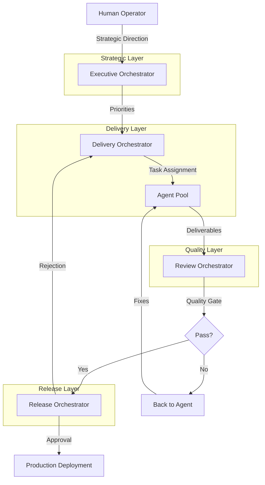
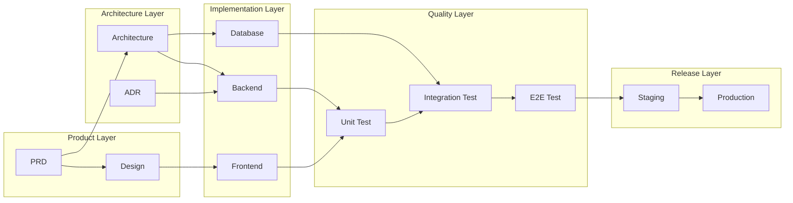

# PART 6 — ORCHESTRATION ARCHITECTURE

**Document:** Enterprise Agentic CRM Delivery Operating System  
**Section:** Part 6 — Orchestration Architecture  
**Classification:** INTERNAL — DO NOT PUSH TO GIT

---

## 6.1 PURPOSE

The Orchestration Architecture defines how agents coordinate, how work flows
through the organization, and how dependencies are managed. Four orchestrators
form the backbone of the delivery system.

---

## 6.2 ORCHESTRATOR TYPES

### Executive Orchestrator
**Mission:** Strategic alignment, prioritization, governance
**Tier:** 1 — Executive
**Reports To:** CEO Agent

**Responsibilities:**
- Align all work with strategic objectives
- Prioritize cross-functional initiatives
- Resolve executive-level conflicts
- Approve major strategic decisions
- Oversee governance compliance

**Decision Authority:**
- Final on: strategic prioritization, cross-functional conflicts
- Requires: CEO approval for budget >$50K

**Inputs:**
- Strategic objectives
- Market intelligence
- Risk assessments
- Performance reports

**Outputs:**
- Strategic priorities
- Resource allocation decisions
- Governance compliance reports

### Delivery Orchestrator
**Mission:** Sprint management, task routing, dependency management
**Tier:** 2 — Director
**Reports To:** COO Agent

**Responsibilities:**
- Manage sprint planning and execution
- Route tasks to appropriate agents
- Manage cross-agent dependencies
- Track delivery progress
- Resolve delivery conflicts
- Coordinate handoffs between agents

**Decision Authority:**
- Final on: task routing, sprint planning
- Requires: CPO approval for scope changes

**Inputs:**
- Product backlog
- Agent capacity
- Dependency graph
- Sprint goals

**Outputs:**
- Sprint plans
- Task assignments
- Progress reports
- Dependency status

### Review Orchestrator
**Mission:** Quality gates, verification, compliance
**Tier:** 2 — Director
**Reports To:** CTO Agent

**Responsibilities:**
- Enforce quality gates
- Coordinate review processes
- Verify compliance
- Track review outcomes
- Manage review boards
- Ensure no self-approval

**Decision Authority:**
- Final on: quality gate pass/fail
- Requires: CTO approval for gate bypass

**Inputs:**
- Code submissions
- Design documents
- Architecture proposals
- Security assessments

**Outputs:**
- Review decisions
- Quality gate results
- Compliance reports
- Defect reports

### Release Orchestrator
**Mission:** Deployment governance, production approval
**Tier:** 2 — Director
**Reports To:** COO Agent

**Responsibilities:**
- Manage release planning
- Coordinate deployment activities
- Verify release readiness
- Approve production deployments
- Manage rollback procedures
- Track release metrics

**Decision Authority:**
- Final on: release readiness, deployment approval
- Requires: CRO approval for risk acceptance

**Inputs:**
- Release candidates
- Test results
- Security scan results
- Performance benchmarks

**Outputs:**
- Release decisions
- Deployment approvals
- Release notes
- Rollback plans

---

## 6.3 ORCHESTRATION FLOW



---

## 6.4 WORKFLOW PATTERNS

### Pattern 1: Feature Development Flow

```
┌─────────────────────────────────────────────────────┐
│              FEATURE DEVELOPMENT FLOW                │
├─────────────────────────────────────────────────────┤
│                                                     │
│  1. PRODUCT DISCOVERY                               │
│     Product Discovery Agent → User Research Agent    │
│     Output: Validated requirement                   │
│                                                     │
│  2. DESIGN                                          │
│     UX Design Agent → UI Design Agent               │
│     Output: Design specifications                   │
│                                                     │
│  3. ARCHITECTURE                                    │
│     Solution Architect → Domain Architect           │
│     Output: Architecture design                     │
│                                                     │
│  4. IMPLEMENTATION                                  │
│     Frontend/Backend Agents                         │
│     Output: Working code                            │
│                                                     │
│  5. TESTING                                         │
│     Unit → Integration → E2E Testing Agents         │
│     Output: Test results                            │
│                                                     │
│  6. REVIEW                                          │
│     Review Orchestrator → Review Boards             │
│     Output: Review decision                         │
│                                                     │
│  7. DEPLOYMENT                                      │
│     Release Orchestrator → DevOps Agent             │
│     Output: Production deployment                   │
│                                                     │
└─────────────────────────────────────────────────────┘
```

### Pattern 2: Incident Response Flow

```
┌─────────────────────────────────────────────────────┐
│              INCIDENT RESPONSE FLOW                  │
├─────────────────────────────────────────────────────┤
│                                                     │
│  1. DETECT                                          │
│     Monitoring Agent → Incident Management Agent    │
│     Output: Incident alert                          │
│                                                     │
│  2. TRIAGE                                          │
│     Incident Management Agent → SRE Agent           │
│     Output: Severity classification                 │
│                                                     │
│  3. INVESTIGATE                                     │
│     SRE Agent → Domain Expert Agent                 │
│     Output: Root cause analysis                     │
│                                                     │
│  4. RESOLVE                                         │
│     Domain Expert Agent → DevOps Agent              │
│     Output: Fix implementation                      │
│                                                     │
│  5. VERIFY                                          │
│     QA Agents → Monitoring Agent                    │
│     Output: Resolution verification                 │
│                                                     │
│  6. REVIEW                                          │
│     Incident Management Agent → CTO Agent           │
│     Output: Post-mortem and improvements            │
│                                                     │
└─────────────────────────────────────────────────────┘
```

### Pattern 3: Architecture Decision Flow

```
┌─────────────────────────────────────────────────────┐
│           ARCHITECTURE DECISION FLOW                 │
├─────────────────────────────────────────────────────┤
│                                                     │
│  1. IDENTIFY                                        │
│     Any Agent → Context Steward                     │
│     Output: Decision need identified                │
│                                                     │
│  2. PROPOSE                                         │
│     Domain Architect → Solution Architect           │
│     Output: ADR draft                               │
│                                                     │
│  3. REVIEW                                          │
│     Architecture Review Board                       │
│     Output: Review decision                         │
│                                                     │
│  4. APPROVE                                         │
│     CTO Agent → Enterprise Architect                │
│     Output: ADR approved                            │
│                                                     │
│  5. IMPLEMENT                                       │
│     Engineering Agents                              │
│     Output: Implementation                          │
│                                                     │
│  6. VERIFY                                          │
│     Review Orchestrator                             │
│     Output: Compliance verified                     │
│                                                     │
└─────────────────────────────────────────────────────┘
```

---

## 6.5 DEPENDENCY MANAGEMENT

### Dependency Types

| Type | Description | Management |
|------|-------------|------------|
| Sequential | Task B depends on Task A completing | Queue management |
| Parallel | Tasks A and B can run simultaneously | Resource allocation |
| Conditional | Task B depends on Task A's output | Data handoff |
| Resource | Tasks A and B compete for same resource | Resource scheduling |
| Knowledge | Task B needs knowledge from Task A | Knowledge transfer |

### Dependency Resolution Rules

1. **Critical Path First** — Dependencies on critical path resolved first
2. **Early Handoff** — Hand off artifacts as soon as ready
3. **Async Preferred** — Prefer async communication over sync
4. **Documentation Required** — All handoffs documented
5. **Validation Required** — All handoffs validated before acceptance

### Dependency Graph



---

## 6.6 TASK ROUTING ALGORITHM

```python
def route_task(task, agent_pool):
    # Step 1: Determine task type
    task_type = classify_task(task)
    
    # Step 2: Find eligible agents
    eligible_agents = [
        agent for agent in agent_pool
        if agent.can_handle(task_type)
        and agent.has_capacity()
        and agent.is_authorized(task)
    ]
    
    # Step 3: Score agents
    scored_agents = []
    for agent in eligible_agents:
        score = calculate_routing_score(agent, task)
        scored_agents.append((agent, score))
    
    # Step 4: Select best agent
    scored_agents.sort(key=lambda x: x[1], reverse=True)
    selected_agent = scored_agents[0][0]
    
    # Step 5: Assign task
    assign_task(selected_agent, task)
    
    # Step 6: Update Knowledge Graph
    update_knowledge_graph(task, selected_agent)
    
    return selected_agent

def calculate_routing_score(agent, task):
    # Factors
    expertise_match = match_expertise(agent, task) * 0.3
    capacity_available = agent.capacity_ratio * 0.2
    trust_score = agent.trust_score / 100 * 0.25
    workload_balance = (1 - agent.workload_ratio) * 0.15
    history_performance = agent.recent_performance * 0.1
    
    return expertise_match + capacity_available + trust_score +            workload_balance + history_performance
```

---

## 6.7 SPRINT MANAGEMENT

### Sprint Cadence

| Activity | Duration | Participants |
|----------|----------|-------------|
| Sprint Planning | 2 hours | Delivery Orchestrator, all agents |
| Daily Standup | 15 minutes | Delivery Orchestrator, active agents |
| Sprint Review | 1 hour | All agents, Review Boards |
| Sprint Retrospective | 1 hour | All agents |
| Backlog Refinement | 2 hours | Product agents, Architecture agents |

### Sprint Lifecycle

```
┌─────────────────────────────────────────────────────┐
│                 SPRINT LIFECYCLE                      │
├─────────────────────────────────────────────────────┤
│                                                     │
│  WEEK 1                                             │
│  ├── Day 1: Sprint Planning                         │
│  ├── Day 2-3: Implementation                        │
│  ├── Day 4: Review & Testing                        │
│  └── Day 5: Integration & Deployment                │
│                                                     │
│  WEEK 2                                             │
│  ├── Day 1: New Sprint Planning                     │
│  ├── Day 2-3: Implementation                        │
│  ├── Day 4: Review & Testing                        │
│  └── Day 5: Sprint Review & Retro                   │
│                                                     │
└─────────────────────────────────────────────────────┘
```

---

## 6.8 CONFLICT RESOLUTION IN ORCHESTRATION

### Conflict Types

| Type | Example | Resolution |
|------|---------|------------|
| Resource Conflict | Two agents need same tool | Delivery Orchestrator schedules |
| Priority Conflict | Two features both P0 | Executive Orchestrator prioritizes |
| Technical Conflict | Two approaches to same problem | Architecture Review Board decides |
| Timeline Conflict | Dependencies block delivery | Delivery Orchestrator re-sequences |

### Resolution Process

1. **Detect** — Context Steward identifies conflict
2. **Classify** — Determine conflict type and severity
3. **Route** — Send to appropriate orchestrator
4. **Resolve** — Orchestrator makes decision
5. **Communicate** — Decision communicated to all affected agents
6. **Verify** — Verify resolution applied correctly

---

*Part 6 complete — Orchestration architecture, workflow patterns, dependency management, task routing, and sprint management defined.*  
*Document maintained by Hermes Agent. Never push to Git.*
