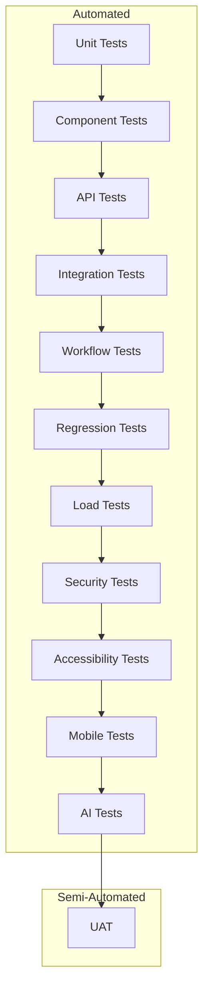

# PART 9 — TESTING FACTORY

**Document:** Enterprise Agentic CRM Delivery Operating System  
**Section:** Part 9 — Testing Factory  
**Classification:** INTERNAL — DO NOT PUSH TO GIT

---

## 9.1 PURPOSE

The Testing Factory provides complete testing architecture for the CRM platform.
Every test type has defined responsible agents, tools, KPIs, and exit criteria.

---

## 9.2 TEST TYPES

### Test Type 1: Unit Testing

**Responsible Agent:** Unit Testing Agent
**Tier:** 4 — Specialist
**Reports To:** QA Architect

**Scope:**
- Individual functions and methods
- Business logic validation
- Edge case handling
- Error handling

**Tools:**
- Go: `go test`, `testify`, `gomock`
- TypeScript: `jest`, `vitest`, `@testing-library/react`

**KPIs:**
- Code Coverage: >80%
- Test Pass Rate: 100%
- Test Execution Time: <30 seconds
- Mutation Score: >70%

**Exit Criteria:**
- All unit tests pass
- Coverage threshold met
- No flaky tests
- Tests reviewed by peer

**Test Structure:**
```go
func TestContactCreation(t *testing.T) {
    // Arrange
    repo := &mockContactRepo{}
    svc := NewContactService(repo)
    
    // Act
    contact, err := svc.CreateContact(ctx, &CreateContactRequest{
        FirstName: "John",
        LastName: "Doe",
        Email: "john@example.com",
    })
    
    // Assert
    assert.NoError(t, err)
    assert.Equal(t, "John", contact.FirstName)
    assert.Equal(t, "Doe", contact.LastName)
    assert.Equal(t, "john@example.com", contact.Email)
}
```

### Test Type 2: Component Testing

**Responsible Agent:** Unit Testing Agent
**Tier:** 4 — Specialist
**Reports To:** QA Architect

**Scope:**
- React component behavior
- Component rendering
- User interactions
- State management

**Tools:**
- React Testing Library
- Storybook
- Chromatic / Percy

**KPIs:**
- Component Coverage: >90%
- Visual Regression: 0 unexpected changes
- Accessibility: WCAG 2.1 AA compliant

**Exit Criteria:**
- All component tests pass
- Visual regression approved
- Accessibility checks pass
- Storybook stories complete

### Test Type 3: API Testing

**Responsible Agent:** Integration Testing Agent
**Tier:** 4 — Specialist
**Reports To:** QA Architect

**Scope:**
- API endpoint validation
- Request/response schema validation
- Authentication/authorization
- Rate limiting
- Error handling

**Tools:**
- Go: `httptest`, `assert`
- Postman / Newman
- curl-based testing

**KPIs:**
- API Test Coverage: 100% endpoints
- Schema Validation: 100%
- Auth Test Coverage: 100%
- Error Handling: 100% scenarios

**Exit Criteria:**
- All API tests pass
- Schema validation passes
- Auth tests pass
- Error handling verified

**Test Structure:**
```go
func TestCreateContactAPI(t *testing.T) {
    // Setup
    router := setupTestRouter()
    token := generateTestToken()
    
    // Act
    w := performRequest(router, "POST", "/api/contacts", 
        map[string]interface{}{
            "first_name": "John",
            "last_name": "Doe",
            "email": "john@example.com",
        }, token)
    
    // Assert
    assert.Equal(t, http.StatusCreated, w.Code)
    
    var response ContactResponse
    json.Unmarshal(w.Body.Bytes(), &response)
    assert.Equal(t, "John", response.FirstName)
}
```

### Test Type 4: Integration Testing

**Responsible Agent:** Integration Testing Agent
**Tier:** 4 — Specialist
**Reports To:** QA Architect

**Scope:**
- Service-to-service communication
- Database operations
- External API integrations
- Message queue operations
- Cache operations

**Tools:**
- Go integration tests
- Testcontainers
- Database fixtures

**KPIs:**
- Integration Coverage: 100% critical paths
- Data Integrity: 100%
- External Integration: 100% mocked/integrated

**Exit Criteria:**
- All integration tests pass
- Data integrity verified
- External integrations working
- Performance within baseline

### Test Type 5: Workflow Testing

**Responsible Agent:** CRM Workflow Specialist
**Tier:** 4 — Specialist
**Reports To:** CRM Architect

**Scope:**
- Workflow trigger execution
- Workflow action execution
- Workflow error handling
- Workflow timeout handling
- Workflow dependency resolution

**Tools:**
- Custom workflow test framework
- State machine testing

**KPIs:**
- Workflow Coverage: 100% active workflows
- Trigger Reliability: 100%
- Action Execution: 100%

**Exit Criteria:**
- All workflow tests pass
- Triggers fire correctly
- Actions execute correctly
- Error handling verified

### Test Type 6: Regression Testing

**Responsible Agent:** Regression Testing Agent
**Tier:** 4 — Specialist
**Reports To:** QA Architect

**Scope:**
- Full test suite execution
- Cross-feature compatibility
- Performance regression
- Security regression

**Tools:**
- Test suite orchestrators
- Performance benchmarks
- Security scanners

**KPIs:**
- Regression Suite Pass Rate: 100%
- Execution Time: <30 minutes
- Flaky Test Rate: <1%

**Exit Criteria:**
- All regression tests pass
- No performance regression
- No security regression
- No feature breakage

### Test Type 7: Load Testing

**Responsible Agent:** Performance Testing Agent
**Tier:** 4 — Specialist
**Reports To:** CTO

**Scope:**
- Concurrent user simulation
- Throughput measurement
- Response time measurement
- Resource utilization

**Tools:**
- k6
- Locust
- Apache JMeter

**KPIs:**
- Concurrent Users: >1000
- Response Time (p95): <200ms
- Error Rate: <1%
- Throughput: >100 req/s

**Exit Criteria:**
- Load test targets met
- No memory leaks
- No connection pool exhaustion
- Graceful degradation under load

### Test Type 8: Stress Testing

**Responsible Agent:** Performance Testing Agent
**Tier:** 4 — Specialist
**Reports To:** CTO

**Scope:**
- Breaking point identification
- Recovery behavior
- Resource exhaustion
- Failover testing

**Tools:**
- k6 with ramping scenarios
- Chaos engineering tools

**KPIs:**
- Breaking Point: Documented
- Recovery Time: <5 minutes
- Data Integrity: Maintained under stress

**Exit Criteria:**
- Breaking point documented
- Recovery behavior verified
- Data integrity maintained
- Graceful failure confirmed

### Test Type 9: Security Testing

**Responsible Agent:** Security Testing Agent
**Tier:** 4 — Specialist
**Reports To:** CSO

**Scope:**
- Vulnerability scanning
- Penetration testing
- OWASP Top 10 testing
- Authentication testing
- Authorization testing
- Input validation testing
- Injection testing

**Tools:**
- OWASP ZAP
- Burp Suite
- Nmap
- Custom security scripts

**KPIs:**
- Critical Vulnerabilities: 0
- High Vulnerabilities: 0
- OWASP Top 10 Coverage: 100%
- Penetration Test Pass: 100%

**Exit Criteria:**
- All security tests pass
- No critical/high vulnerabilities
- OWASP Top 10 addressed
- Penetration test approved

### Test Type 10: Accessibility Testing

**Responsible Agent:** Accessibility Testing Agent
**Tier:** 4 — Specialist
**Reports To:** CSO

**Scope:**
- WCAG 2.1 AA compliance
- Screen reader compatibility
- Keyboard navigation
- Color contrast
- ARIA attributes

**Tools:**
- axe-core
- WAVE
- Screen readers (NVDA, VoiceOver)
- Keyboard testing

**KPIs:**
- WCAG Compliance: 100%
- Screen Reader: Fully compatible
- Keyboard Navigation: 100%
- Color Contrast: AA compliant

**Exit Criteria:**
- All accessibility tests pass
- WCAG 2.1 AA compliant
- Screen reader compatible
- Keyboard accessible

### Test Type 11: Mobile Testing

**Responsible Agent:** E2E Testing Agent
**Tier:** 4 — Specialist
**Reports To:** QA Architect

**Scope:**
- iOS compatibility
- Android compatibility
- Responsive design
- Touch interactions
- Offline behavior

**Tools:**
- Appium
- BrowserStack
- Physical devices

**KPIs:**
- iOS Compatibility: 100%
- Android Compatibility: 100%
- Responsive Design: All breakpoints
- Touch Interactions: 100%

**Exit Criteria:**
- All mobile tests pass
- iOS compatible
- Android compatible
- Responsive design verified

### Test Type 12: AI Testing

**Responsible Agent:** AI Engineer
**Tier:** 4 — Specialist
**Reports To:** AI Architect

**Scope:**
- Prompt accuracy
- Hallucination detection
- Bias testing
- Cost tracking
- Latency measurement

**Tools:**
- Custom AI test framework
- LLM evaluation tools
- Cost tracking tools

**KPIs:**
- Prompt Accuracy: >95%
- Hallucination Rate: <5%
- Bias Score: Within threshold
- Cost per Transaction: Within budget

**Exit Criteria:**
- All AI tests pass
- Accuracy meets threshold
- Bias within limits
- Cost within budget

### Test Type 13: UAT (User Acceptance Testing)

**Responsible Agent:** UAT Agent
**Tier:** 4 — Specialist
**Reports To:** CPO

**Scope:**
- Business scenario validation
- User workflow validation
- Usability validation
- Acceptance criteria validation

**Tools:**
- UAT test scripts
- User feedback forms
- Usability testing platforms

**KPIs:**
- Scenario Pass Rate: 100%
- User Satisfaction: >4.0/5.0
- Acceptance Criteria: 100% met

**Exit Criteria:**
- All UAT scenarios pass
- User acceptance granted
- Acceptance criteria met
- No blocking issues

---

## 9.3 TEST EXECUTION ORDER



---

## 9.4 TEST DATA MANAGEMENT

### Test Data Strategy

| Data Type | Strategy | Refresh Frequency |
|-----------|----------|-------------------|
| Unit Test Data | Mocked | Every test run |
| Integration Test Data | Fixtures | Every test run |
| E2E Test Data | Seeded | Every test run |
| Performance Test Data | Generated | Weekly |
| Security Test Data | Vulnerable configs | Monthly |

### Test Data Rules

1. **No Production Data** — Never use real customer data in tests
2. **Synthetic Data** — Use generated data for all tests
3. **Isolation** — Each test suite has isolated data
4. **Cleanup** — Test data cleaned up after execution
5. **Versioned** — Test data versioned with code

---

## 9.5 TEST ENVIRONMENTS

| Environment | Purpose | Data | Frequency |
|-------------|---------|------|-----------|
| Development | Local development | Mocked | Continuous |
| CI | Automated testing | Fixtures | Every commit |
| Staging | Pre-production validation | Seeded | Daily |
| Production | Live system | Real data | Continuous monitoring |

---

## 9.6 FLAKY TEST MANAGEMENT

### Detection
- Tests that pass/fail intermittently
- Tests with >5% flakiness rate
- Tests with timing dependencies

### Resolution
1. Identify root cause
2. Fix flaky test or mark as flaky
3. Add to flaky test tracking
4. Schedule fix within 2 sprints

### Prevention
- Avoid timing dependencies
- Use deterministic test data
- Mock external dependencies
- Use proper wait mechanisms

---

*Part 9 complete — 13 test types defined with agents, tools, KPIs, exit criteria, and execution order.*  
*Document maintained by Hermes Agent. Never push to Git.*
