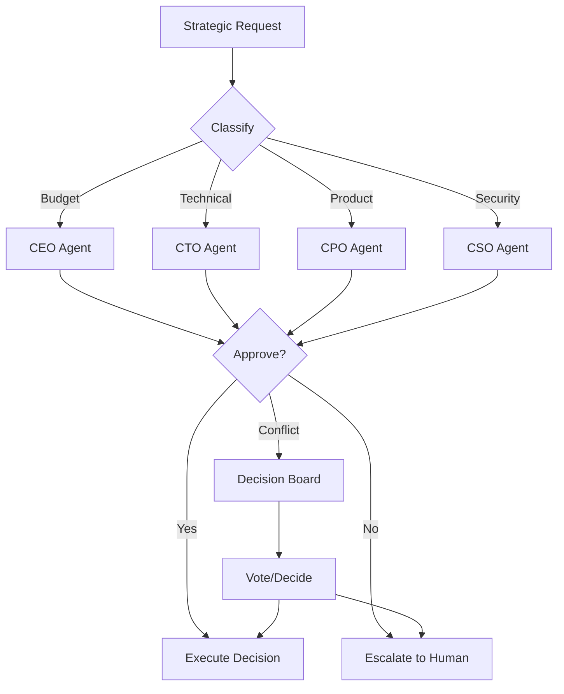
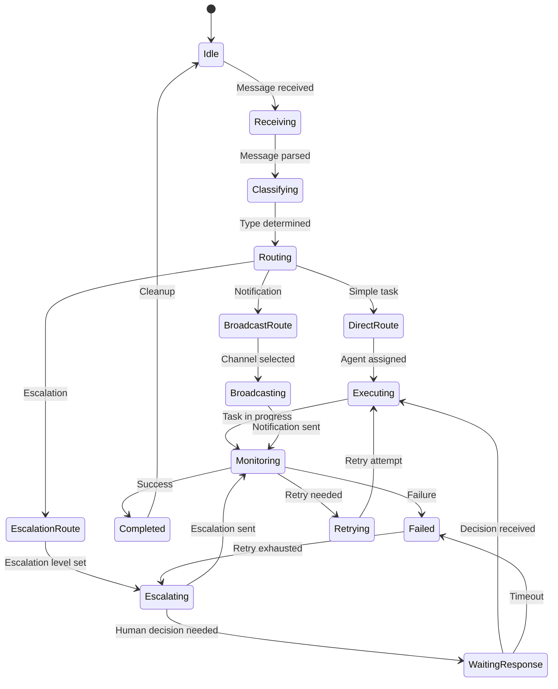

# PART 3 — RUNTIME ORCHESTRATION ARCHITECTURE

**Document:** Enterprise Agentic CRM Delivery Operating System  
**Section:** Part 3 — Runtime Orchestration Architecture  
**Classification:** INTERNAL — DO NOT PUSH TO GIT

---

## 1. ORCHESTRATION HIERARCHY

```
┌─────────────────────────────────────────────────────────────────┐
│                    ORCHESTRATION HIERARCHY                       │
├─────────────────────────────────────────────────────────────────┤
│                                                                 │
│                    ┌─────────────────┐                          │
│                    │    EXECUTIVE    │                          │
│                    │  ORCHESTRATOR   │                          │
│                    │   (Tier 1)      │                          │
│                    └────────┬────────┘                          │
│                             │                                   │
│            ┌────────────────┼────────────────┐                 │
│            ▼                ▼                ▼                  │
│     ┌────────────┐  ┌────────────┐  ┌────────────┐           │
│     │  PROGRAM   │  │  PROGRAM   │  │  PROGRAM   │           │
│     │   ORCH.    │  │   ORCH.    │  │   ORCH.    │           │
│     │ (Strategy) │  │  (Product) │  │  (Eng/Inf) │           │
│     │  Tier 2    │  │  Tier 2    │  │  Tier 2    │           │
│     └─────┬──────┘  └─────┬──────┘  └─────┬──────┘           │
│           │               │               │                    │
│     ┌─────┼─────┐   ┌────┼────┐   ┌──────┼──────┐           │
│     ▼     ▼     ▼   ▼    ▼    ▼   ▼      ▼      ▼           │
│  ┌─────┐┌────┐┌────┐┌────┐┌────┐┌────┐┌────┐┌────┐         │
│  │DELIV││DEL ││DEL ││DEL ││DEL ││DEL ││DEL ││DEL │         │
│  │ORCH ││ORCH││ORCH││ORCH││ORCH││ORCH││ORCH││ORCH│         │
│  │Tier3││T3  ││T3  ││T3  ││T3  ││T3  ││T3  ││T3  │         │
│  └──┬──┘└──┬─┘└──┬─┘└──┬─┘└──┬─┘└──┬─┘└──┬─┘└──┬─┘         │
│     │      │     │     │     │     │     │     │              │
│  ┌──┴──┐┌──┴──┐┌─┴──┐┌─┴──┐┌─┴──┐┌─┴──┐┌─┴──┐┌─┴──┐       │
│  │WORK ││WORK ││WORK││WORK││WORK││WORK││WORK││WORK│       │
│  │AGENTS││AGENTS││AGENTS││AGENTS││AGENTS││AGENTS││AGENTS││AGENTS│       │
│  │Tier4││T4   ││T4  ││T4  ││T4  ││T4  ││T4  ││T4  │       │
│  └─────┘└─────┘└────┘└────┘└────┘└────┘└────┘└────┘       │
│                                                                 │
└─────────────────────────────────────────────────────────────────┘
```

---

## 2. EXECUTIVE ORCHESTRATOR

### Responsibilities
- Set strategic direction and OKRs
- Approve Tier 1 ADRs
- Resolve C-Suite escalations
- Manage budget allocations
- Oversee AI governance policy

### Routing Logic

```yaml
executive_routing:
  strategic_decisions:
    target: "CEO Agent"
    trigger: "Budget >$10K, Policy change, Partnership"
  
  technical_decisions:
    target: "CTO Agent"
    trigger: "Architecture change, Technology adoption"
  
  product_decisions:
    target: "CPO Agent"
    trigger: "Feature priority, Roadmap change"
  
  operational_decisions:
    target: "COO Agent"
    trigger: "Process change, Resource allocation"
  
  security_decisions:
    target: "CSO Agent"
    trigger: "Security policy, Compliance"
```

### Approval Logic

```yaml
executive_approval:
  tier1_adr:
    approver: "CEO Agent"
    reviewers: ["CTO Agent", "CPO Agent"]
    criteria: "Strategic alignment, ROI, Risk"
    timeout: "48_hours"
  
  budget_allocation:
    approver: "CEO Agent"
    reviewers: ["CFO Agent"]
    criteria: "ROI, Budget impact"
    timeout: "24_hours"
  
  partnership:
    approver: "CEO Agent"
    reviewers: ["CRO Agent", "Legal"]
    criteria: "Strategic value, Legal compliance"
    timeout: "72_hours"
```

### Failure Handling

```yaml
executive_failure_handling:
  agent_timeout:
    action: "Retry with backup agent"
    timeout: "4_hours"
    escalation: "Human operator"
  
  conflict:
    action: "Convene decision board"
    members: ["CEO", "CTO", "CPO"]
    timeout: "24_hours"
    fallback: "Human operator"
  
  resource_constraint:
    action: "Reallocate budget"
    approver: "CFO Agent"
    timeout: "24_hours"
```

### Mermaid Diagram



---

## 3. PROGRAM ORCHESTRATOR

### 3.1 Strategy Program Orchestrator

```yaml
strategy_program:
  scope: "Market intelligence, competitive analysis, innovation"
  agents: ["STRAT-001", "STRAT-002", "STRAT-003", "STRAT-004", "STRAT-005", "STRAT-006"]
  
  routing:
    competitive_intelligence:
      target: "STRAT-003"
      trigger: "Competitor activity detected"
    
    market_research:
      target: "STRAT-002"
      trigger: "Market data request"
    
    innovation:
      target: "STRAT-004"
      trigger: "Technology opportunity identified"
    
    strategy_recommendation:
      target: "STRAT-001"
      trigger: "Strategic decision needed"
  
  approval:
    strategy_recommendation:
      approver: "CPO Agent"
      reviewers: ["CEO Agent"]
      criteria: "Data-driven, Strategic alignment"
```

### 3.2 Product Program Orchestrator

```yaml
product_program:
  scope: "Product strategy, roadmap, requirements"
  agents: ["PROD-001", "PROD-002", "PROD-003", "PROD-004", "PROD-005", "PROD-006"]
  
  routing:
    requirement:
      target: "PROD-001"
      trigger: "Customer need identified"
    
    research:
      target: "PROD-002"
      trigger: "Hypothesis to validate"
    
    backlog:
      target: "PROD-003"
      trigger: "New item to prioritize"
    
    roadmap:
      target: "PROD-004"
      trigger: "Timeline change"
    
    validation:
      target: "PROD-005"
      trigger: "Hypothesis to test"
    
    prioritization:
      target: "PROD-006"
      trigger: "Features to rank"
  
  approval:
    feature_specification:
      approver: "CPO Agent"
      reviewers: ["Product Management Agent"]
      criteria: "Customer need, Acceptance criteria"
```

### 3.3 Design Program Orchestrator

```yaml
design_program:
  scope: "UX research, design, accessibility"
  agents: ["DES-001", "DES-002", "DES-003", "DES-004", "DES-005", "DES-006", "DES-007"]
  
  routing:
    ux_research:
      target: "DES-001"
      trigger: "User research needed"
    
    ux_design:
      target: "DES-002"
      trigger: "User flow design needed"
    
    ui_design:
      target: "DES-003"
      trigger: "Visual design needed"
    
    design_system:
      target: "DES-004"
      trigger: "New component needed"
    
    accessibility:
      target: "DES-005"
      trigger: "Accessibility audit"
    
    journey_mapping:
      target: "DES-006"
      trigger: "Journey optimization"
    
    design_qa:
      target: "DES-007"
      trigger: "Implementation review"
  
  approval:
    design_delivery:
      approver: "CPO Agent"
      reviewers: ["UX Review Board"]
      criteria: "Usability, Accessibility, Consistency"
```

### 3.4 Engineering Program Orchestrator

```yaml
engineering_program:
  scope: "Architecture, implementation, testing"
  agents: ["ARCH-*", "ENG-*", "QA-*"]
  
  routing:
    architecture:
      target: "ARCH-001 or ARCH-002"
      trigger: "Architecture decision needed"
    
    implementation:
      target: "ENG-001 or ENG-002"
      trigger: "Feature to implement"
    
    testing:
      target: "QA-001"
      trigger: "Testing strategy needed"
    
    security:
      target: "QA-005"
      trigger: "Security testing needed"
  
  approval:
    code_delivery:
      approver: "Architecture Review Board"
      reviewers: ["Security Architect", "QA Architect"]
      criteria: "Tests passing, Security reviewed, Performance validated"
```

### 3.5 DevSecOps Program Orchestrator

```yaml
devsecops_program:
  scope: "CI/CD, monitoring, security operations"
  agents: ["DEVOPS-001", "DEVOPS-002", "DEVOPS-003"]
  
  routing:
    deployment:
      target: "DEVOPS-001"
      trigger: "Code ready for deployment"
    
    monitoring:
      target: "DEVOPS-002"
      trigger: "System alert"
    
    security_ops:
      target: "DEVOPS-003"
      trigger: "Security alert"
  
  approval:
    production_deployment:
      approver: "Release Train Engineer"
      reviewers: ["QA Architect", "Security Architect"]
      criteria: "Tests passing, Security clean, Rollback ready"
```

---

## 4. DELIVERY ORCHESTRATOR

### Responsibilities
- Assign tasks to work agents
- Track task progress
- Handle task failures
- Coordinate dependencies
- Report status to program orchestrator

### Routing Logic

```yaml
delivery_routing:
  task_assignment:
    strategy: "capability_matching"
    factors:
      - "Agent capability"
      - "Agent availability"
      - "Agent tier"
      - "Agent department"
      - "Historical performance"
    
    rules:
      - "Tier 4 agents receive Tier 4 tasks"
      - "Same department preferred"
      - "Available agents only"
      - "Performance >Tier C required"
  
  task_distribution:
    algorithm: "weighted_round_robin"
    weights:
      - "Capability: 40%"
      - "Availability: 30%"
      - "Performance: 20%"
      - "Load: 10%"
```

### Approval Logic

```yaml
delivery_approval:
  task_completion:
    approver: "Delivery Orchestrator"
    reviewers: ["QA Agent"]
    criteria: "Acceptance criteria met"
    timeout: "4_hours"
  
  code_delivery:
    approver: "Architecture Review Board"
    reviewers: ["Security Architect", "QA Architect"]
    criteria: "Tests passing, Security clean"
    timeout: "24_hours"
```

### Failure Handling

```yaml
delivery_failure_handling:
  task_failure:
    max_retries: 3
    retry_delay: "exponential_backoff"
    fallback: "Reassign to different agent"
    escalation: "Manager Agent"
  
  agent_unavailable:
    action: "Reassign to backup agent"
    timeout: "1_hour"
    escalation: "Delivery Orchestrator"
  
  dependency_block:
    action: "Wait for dependency"
    timeout: "24_hours"
    escalation: "Program Orchestrator"
```

---

## 5. REVIEW ORCHESTRATOR

### Responsibilities
- Route deliverables to appropriate review boards
- Track review status
- Handle review feedback
- Approve or reject deliverables
- Escalate review conflicts

### Review Board Routing

```yaml
review_routing:
  architecture_review:
    board: "Architecture Review Board"
    trigger: "ADR submitted or architecture change"
    approvers: ["Enterprise Architect", "Security Architect"]
    criteria: "Standards compliance, Security, Performance"
    timeout: "48_hours"
  
  code_review:
    board: "Code Review Board"
    trigger: "PR submitted"
    approvers: ["Backend Architect", "Frontend Architect"]
    criteria: "Code quality, Test coverage, Documentation"
    timeout: "24_hours"
  
  security_review:
    board: "Security Review Board"
    trigger: "Security-sensitive change"
    approvers: ["CSO Agent", "Security Architect"]
    criteria: "OWASP compliance, Input validation, Auth"
    timeout: "24_hours"
  
  design_review:
    board: "UX Review Board"
    trigger: "UI/UX change"
    approvers: ["UX Design Agent", "Accessibility Agent"]
    criteria: "Usability, Accessibility, Consistency"
    timeout: "24_hours"
  
  product_review:
    board: "Product Review Board"
    trigger: "Feature specification"
    approvers: ["CPO Agent", "Product Management Agent"]
    criteria: "Customer need, Acceptance criteria"
    timeout: "24_hours"
```

### Review Process

```
1. SUBMIT: Agent submits deliverable for review
2. ROUTE: Review Orchestrator routes to appropriate board
3. REVIEW: Board reviews deliverable
4. DECIDE: Board approves, rejects, or requests changes
5. FEEDBACK: Board provides feedback
6. ITERATE: Agent addresses feedback
7. APPROVE: Board approves final deliverable
8. RECORD: Record decision in ADR store
```

---

## 6. RELEASE ORCHESTRATOR

### Responsibilities
- Coordinate release planning
- Track release readiness
- Execute release process
- Handle release failures
- Manage rollbacks

### Release Process

```yaml
release_process:
  planning:
    - "Define release scope"
    - "Identify dependencies"
    - "Set release timeline"
    - "Allocate resources"
  
  preparation:
    - "Code freeze"
    - "Final testing"
    - "Security scan"
    - "Documentation update"
    - "Rollback plan"
  
  execution:
    - "Deploy to staging"
    - "Verify staging"
    - "Deploy to production"
    - "Verify production"
    - "Monitor"
  
  rollback:
    - "Detect issue"
    - "Assess impact"
    - "Execute rollback"
    - "Verify rollback"
    - "Post-mortem"
```

### Release Readiness Criteria

```yaml
release_readiness:
  mandatory:
    - "All tests passing"
    - "Security scan clean"
    - "Performance validated"
    - "Documentation updated"
    - "Rollback plan ready"
    - "Stakeholders notified"
  
  recommended:
    - "Load testing completed"
    - "Chaos testing completed"
    - "Accessibility audit passed"
    - "Design QA passed"
  
  approval:
    approver: "Release Train Engineer"
    reviewers: ["QA Architect", "Security Architect", "COO Agent"]
    criteria: "All mandatory criteria met"
```

---

## 7. ORCHESTRATION STATE MACHINE



---

## 8. ORCHESTRATION CONFIGURATION

```yaml
orchestration_config:
  executive:
    max_concurrent_tasks: 5
    task_timeout: "48_hours"
    escalation_timeout: "24_hours"
  
  program:
    max_concurrent_tasks: 10
    task_timeout: "24_hours"
    escalation_timeout: "8_hours"
  
  delivery:
    max_concurrent_tasks: 20
    task_timeout: "8_hours"
    escalation_timeout: "4_hours"
  
  review:
    max_concurrent_reviews: 15
    review_timeout: "24_hours"
    escalation_timeout: "8_hours"
  
  release:
    max_concurrent_releases: 1
    release_timeout: "4_hours"
    rollback_timeout: "1_hour"
```

---

*Part 3 complete — Full runtime orchestration architecture with all 5 orchestrator types, routing logic, approval logic, failure handling, retry logic, and Mermaid diagrams.*  
*Document maintained by Hermes Agent. Never push to Git.*
