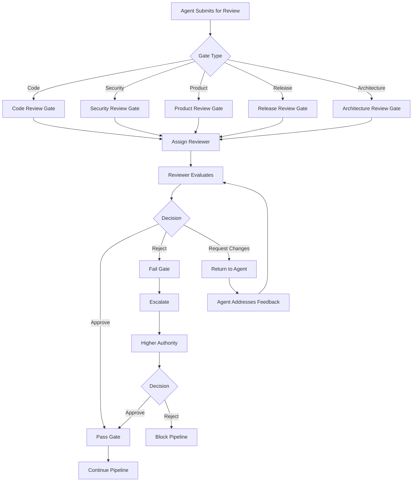
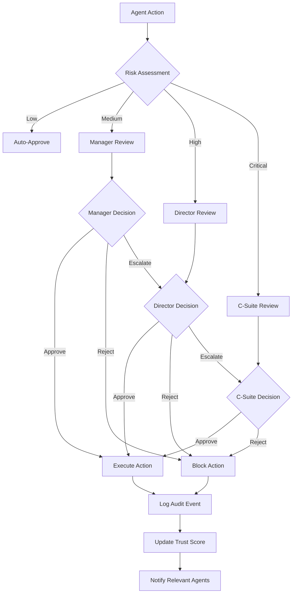

# PART 6 — AGENT GOVERNANCE ENFORCEMENT

**Document:** Enterprise Agentic CRM Delivery Operating System  
**Section:** Part 6 — Agent Governance Enforcement  
**Classification:** INTERNAL — DO NOT PUSH TO GIT

---

## 1. GOVERNANCE FRAMEWORK OVERVIEW

```
┌─────────────────────────────────────────────────────────────────┐
│                    GOVERNANCE FRAMEWORK                          │
├─────────────────────────────────────────────────────────────────┤
│                                                                 │
│  ┌─────────────────────────────────────────────────────────┐   │
│  │                    APPROVAL GATES                        │   │
│  │  ┌──────────┐ ┌──────────┐ ┌──────────┐ ┌──────────┐  │   │
│  │  │ Code     │ │Security  │ │Product   │ │Release   │  │   │
│  │  │ Review   │ │Review    │ │Review    │ │Review    │  │   │
│  │  └──────────┘ └──────────┘ └──────────┘ └──────────┘  │   │
│  └─────────────────────────────────────────────────────────┘   │
│                                                                 │
│  ┌─────────────────────────────────────────────────────────┐   │
│  │                    POLICY ENGINE                         │   │
│  │  ┌──────────┐ ┌──────────┐ ┌──────────┐ ┌──────────┐  │   │
│  │  │ Security │ │Quality   │ │Compliance│ │AI        │  │   │
│  │  │ Policies │ │Policies  │ │Policies  │ │Policies  │  │   │
│  │  └──────────┘ └──────────┘ └──────────┘ └──────────┘  │   │
│  └─────────────────────────────────────────────────────────┘   │
│                                                                 │
│  ┌─────────────────────────────────────────────────────────┐   │
│  │                    TRUST & RISK SCORING                  │   │
│  │  ┌──────────┐ ┌──────────┐ ┌──────────┐ ┌──────────┐  │   │
│  │  │ Agent    │ │Decision  │ │Action    │ │Outcome   │  │   │
│  │  │ Trust    │ │Risk      │ │Risk      │ │Tracking  │  │   │
│  │  └──────────┘ └──────────┘ └──────────┘ └──────────┘  │   │
│  └─────────────────────────────────────────────────────────┘   │
│                                                                 │
│  ┌─────────────────────────────────────────────────────────┐   │
│  │                    AUDIT LOGGING                         │   │
│  │  ┌──────────┐ ┌──────────┐ ┌──────────┐ ┌──────────┐  │   │
│  │  │ Action   │ │Decision  │ │Access    │ │Anomaly   │  │   │
│  │  │ Logs     │ │Logs      │ │Logs      │ │Logs      │  │   │
│  │  └──────────┘ └──────────┘ └──────────┘ └──────────┘  │   │
│  └─────────────────────────────────────────────────────────┘   │
│                                                                 │
│  ┌─────────────────────────────────────────────────────────┐   │
│  │              SELF-APPROVAL PROHIBITION                   │   │
│  │  ┌──────────────────────────────────────────────────┐  │   │
│  │  │ No agent may approve its own decisions            │  │   │
│  │  │ No agent may review its own code                  │  │   │
│  │  │ No agent may deploy its own changes               │  │   │
│  │  │ All approvals require different agent              │  │   │
│  │  └──────────────────────────────────────────────────┘  │   │
│  └─────────────────────────────────────────────────────────┘   │
│                                                                 │
└─────────────────────────────────────────────────────────────────┘
```

---

## 2. APPROVAL GATES

### 2.1 Gate Definitions

```yaml
approval_gates:
  code_review_gate:
    name: "Code Review"
    trigger: "PR submitted"
    approvers:
      required: 1
      eligible:
        - "Backend Architect Agent (ENG-002)"
        - "Frontend Architect Agent (ENG-001)"
        - "Tech Lead Agent"
    criteria:
      - "Code quality standards met"
      - "Tests passing"
      - "Documentation updated"
      - "No security vulnerabilities"
    timeout: "24_hours"
    escalation: "Architecture Review Board"
  
  security_review_gate:
    name: "Security Review"
    trigger: "Security-sensitive change"
    approvers:
      required: 1
      eligible:
        - "Security Architect Agent"
        - "CSO Agent"
    criteria:
      - "OWASP compliance"
      - "Input validation"
      - "Auth/authz verified"
      - "No known vulnerabilities"
    timeout: "24_hours"
    escalation: "CSO Agent"
  
  product_review_gate:
    name: "Product Review"
    trigger: "Feature specification"
    approvers:
      required: 1
      eligible:
        - "CPO Agent"
        - "Product Management Agent"
    criteria:
      - "Customer need documented"
      - "Acceptance criteria clear"
      - "Success metrics defined"
    timeout: "24_hours"
    escalation: "CEO Agent"
  
  release_review_gate:
    name: "Release Review"
    trigger: "Release candidate"
    approvers:
      required: 2
      eligible:
        - "QA Architect Agent"
        - "Security Architect Agent"
        - "COO Agent"
        - "Release Train Engineer"
    criteria:
      - "All tests passing"
      - "Security scan clean"
      - "Performance validated"
      - "Rollback plan ready"
    timeout: "48_hours"
    escalation: "CEO Agent"
  
  architecture_review_gate:
    name: "Architecture Review"
    trigger: "ADR submitted"
    approvers:
      required: 2
      eligible:
        - "Enterprise Architect Agent"
        - "Security Architect Agent"
        - "CTO Agent"
    criteria:
      - "Follows architecture principles"
      - "Security reviewed"
      - "Performance acceptable"
      - "Scalability validated"
    timeout: "48_hours"
    escalation: "CTO Agent"
```

### 2.2 Gate Process



---

## 3. POLICY ENGINE

### 3.1 Security Policies

```yaml
security_policies:
  authentication:
    - "All agents must authenticate via API keys"
    - "JWT tokens must be validated on every request"
    - "Token expiration: 1 hour"
    - "Refresh tokens: 7 days"
  
  authorization:
    - "RBAC enforced on all endpoints"
    - "Agent permissions must match tier"
    - "Cross-tenant access forbidden"
    - "Principle of least privilege"
  
  data_protection:
    - "PII encrypted at rest (AES-256)"
    - "PII encrypted in transit (TLS 1.3)"
    - "Data masking in logs"
    - "No PII in error messages"
  
  input_validation:
    - "All inputs validated against schema"
    - "SQL injection prevention (parameterized queries)"
    - "XSS prevention (output encoding)"
    - "File upload validation"
  
  secrets_management:
    - "No secrets in code or config files"
    - "Secrets stored in environment variables"
    - "Secrets rotated every 90 days"
    - "Secrets access logged"
```

### 3.2 Quality Policies

```yaml
quality_policies:
  code_quality:
    - "All code must pass linter"
    - "All code must have >80% test coverage"
    - "All code must be reviewed before merge"
    - "All code must follow style guide"
  
  testing:
    - "Unit tests required for all new code"
    - "Integration tests required for API changes"
    - "E2E tests required for UI changes"
    - "Security tests required for auth changes"
    - "Performance tests required for critical paths"
  
  documentation:
    - "API endpoints must be documented"
    - "Architecture decisions must be recorded as ADRs"
    - "Complex algorithms must be documented"
    - "Deployment procedures must be documented"
```

### 3.3 Compliance Policies

```yaml
compliance_policies:
  gdpr:
    - "Right to access: Export user data within 30 days"
    - "Right to deletion: Delete user data within 30 days"
    - "Data portability: Export in standard format"
    - "Consent management: Track consent status"
  
  soc2:
    - "Access logging for all data access"
    - "Change logging for all data changes"
    - "Incident response within 24 hours"
    - "Annual security audit"
  
  hipaa:
    - "PHI encryption at rest and in transit"
    - "PHI access logging"
    - "PHI minimum necessary access"
    - "PHI disposal procedures"
```

### 3.4 AI Policies

```yaml
ai_policies:
  transparency:
    - "AI must disclose it is AI"
    - "AI recommendations must include rationale"
    - "AI confidence scores must be provided"
    - "AI limitations must be documented"
  
  fairness:
    - "No discrimination in AI decisions"
    - "Bias testing required for AI models"
    - "Fairness metrics must be tracked"
    - "Human override available for all AI decisions"
  
  safety:
    - "AI must fail safely"
    - "AI must not make irreversible decisions without approval"
    - "AI must escalate to human for edge cases"
    - "AI must be monitored for drift"
  
  cost:
    - "AI token usage tracked per agent"
    - "AI cost budgets enforced"
    - "AI usage optimization required"
    - "AI cost reports generated weekly"
```

---

## 4. TRUST & RISK SCORING

### 4.1 Agent Trust Score

```yaml
agent_trust_scoring:
  components:
    task_completion_rate:
      weight: 0.3
      calculation: "completed_tasks / total_tasks"
      target: ">0.95"
    
    error_rate:
      weight: 0.25
      calculation: "1 - (errors / total_tasks)"
      target: ">0.95"
    
    review_approval_rate:
      weight: 0.2
      calculation: "approved_reviews / total_reviews"
      target: ">0.9"
    
    peer_feedback:
      weight: 0.15
      calculation: "average_peer_rating"
      target: ">4.0"
    
    on_time_delivery:
      weight: 0.1
      calculation: "on_time_deliveries / total_deliveries"
      target: ">0.9"
  
  tiers:
    tier_a:
      score_range: "0.9 - 1.0"
      privileges:
        - "Auto-approve low-risk changes"
        - "Access to all tools"
        - "Priority task assignment"
        - "Reduced review requirements"
    
    tier_b:
      score_range: "0.7 - 0.89"
      privileges:
        - "Standard approval process"
        - "Access to most tools"
        - "Normal task assignment"
        - "Standard review requirements"
    
    tier_c:
      score_range: "0.5 - 0.69"
      privileges:
        - "Enhanced approval process"
        - "Limited tool access"
        - "Lower priority tasks"
        - "Enhanced review requirements"
    
    tier_d:
      score_range: "0.0 - 0.49"
      privileges:
        - "Manual approval required"
        - "Minimal tool access"
        - "Simple tasks only"
        - "Mandatory review"
        - "Performance improvement plan"
```

### 4.2 Decision Risk Score

```yaml
decision_risk_scoring:
  risk_factors:
    impact:
      low: "Reversible, minimal cost"
      medium: "Partially reversible, moderate cost"
      high: "Irreversible, significant cost"
      critical: "Irreversible, major cost"
    
    scope:
      local: "Single agent, single module"
      team: "Multiple agents, single department"
      cross_team: "Multiple departments"
      organization: "Entire organization"
    
    data_sensitivity:
      public: "No sensitive data"
      internal: "Internal data only"
      confidential: "Confidential data"
      restricted: "PII, PHI, financial data"
    
    reversibility:
      fully_reversible: "Can be undone completely"
      partially_reversible: "Can be partially undone"
      irreversible: "Cannot be undone"
  
  risk_matrix:
    low_risk:
      criteria: "impact=low AND scope=local"
      approval: "Agent self-approval allowed"
      review: "Peer review optional"
    
    medium_risk:
      criteria: "impact=medium OR scope=team"
      approval: "Manager approval required"
      review: "Peer review required"
    
    high_risk:
      criteria: "impact=high OR scope=cross_team OR data_sensitivity=restricted"
      approval: "Director approval required"
      review: "Architecture review required"
    
    critical_risk:
      criteria: "impact=critical OR scope=organization"
      approval: "C-Suite approval required"
      review: "Full review board required"
```

### 4.3 Action Risk Score

```yaml
action_risk_scoring:
  actions:
    read_code:
      risk: "low"
      approval: "none"
      logging: "audit_log"
    
    write_code:
      risk: "low"
      approval: "peer_review"
      logging: "audit_log"
    
    delete_code:
      risk: "medium"
      approval: "manager_review"
      logging: "audit_log + notification"
    
    database_write:
      risk: "high"
      approval: "manager_review + backup"
      logging: "audit_log + notification"
    
    database_delete:
      risk: "critical"
      approval: "director_review + backup + approval"
      logging: "audit_log + notification + alert"
    
    infrastructure_change:
      risk: "high"
      approval: "architect_review + manager_approval"
      logging: "audit_log + notification"
    
    production_deploy:
      risk: "critical"
      approval: "release_review + manager_approval"
      logging: "audit_log + notification + alert"
    
    security_change:
      risk: "critical"
      approval: "security_review + director_approval"
      logging: "audit_log + notification + alert"
```

---

## 5. AUDIT LOGGING

### 5.1 Audit Log Schema

```sql
CREATE TABLE audit_logs (
    id UUID PRIMARY KEY DEFAULT gen_random_uuid(),
    timestamp TIMESTAMP DEFAULT NOW(),
    agent_id VARCHAR(50) NOT NULL,
    action VARCHAR(100) NOT NULL,
    resource_type VARCHAR(50),
    resource_id UUID,
    action_details JSONB,
    risk_level VARCHAR(20),
    approval_status VARCHAR(20),
    approved_by VARCHAR(50),
    ip_address INET,
    user_agent TEXT,
    result VARCHAR(20),
    error_message TEXT,
    metadata JSONB
);

CREATE INDEX idx_audit_agent ON audit_logs(agent_id, timestamp);
CREATE INDEX idx_audit_action ON audit_logs(action, timestamp);
CREATE INDEX idx_audit_resource ON audit_logs(resource_type, resource_id);
CREATE INDEX idx_audit_risk ON audit_logs(risk_level, timestamp);
CREATE INDEX idx_audit_time ON audit_logs(timestamp DESC);
```

### 5.2 Audit Event Types

```yaml
audit_events:
  agent_actions:
    - "agent.task.started"
    - "agent.task.completed"
    - "agent.task.failed"
    - "agent.code.written"
    - "agent.code.reviewed"
    - "agent.code.approved"
    - "agent.code.rejected"
  
  data_actions:
    - "data.created"
    - "data.read"
    - "data.updated"
    - "data.deleted"
    - "data.exported"
    - "data.imported"
  
  security_actions:
    - "security.login"
    - "security.logout"
    - "security.token.issued"
    - "security.token.revoked"
    - "security.permission.granted"
    - "security.permission.denied"
  
  governance_actions:
    - "governance.approval.requested"
    - "governance.approval.granted"
    - "governance.approval.denied"
    - "governance.escalation.triggered"
    - "governance.policy.violation"
  
  system_actions:
    - "system.deployment.started"
    - "system.deployment.completed"
    - "system.deployment.failed"
    - "system.rollback.started"
    - "system.rollback.completed"
```

### 5.3 Audit Reporting

```yaml
audit_reporting:
  daily:
    - "Agent activity summary"
    - "Security events"
    - "Policy violations"
    - "Approval statistics"
  
  weekly:
    - "Agent performance summary"
    - "Risk score trends"
    - "Compliance status"
    - "Anomaly detection results"
  
  monthly:
    - "Full audit report"
    - "Security audit"
    - "Compliance audit"
    - "Agent trust score trends"
  
  on_demand:
    - "Specific agent investigation"
    - "Specific resource investigation"
    - "Incident investigation"
    - "Compliance investigation"
```

---

## 6. SELF-APPROVAL PROHIBITION

### 6.1 Rules

```yaml
self_approval_rules:
  code_review:
    rule: "Author cannot approve own PR"
    enforcement: "GitHub branch protection"
    bypass: "None"
  
  architecture_review:
    rule: "Author cannot approve own ADR"
    enforcement: "ADR workflow validation"
    bypass: "None"
  
  security_review:
    rule: "Author cannot approve own security change"
    enforcement: "Security review workflow"
    bypass: "None"
  
  release_review:
    rule: "Author cannot approve own release"
    enforcement: "Release workflow validation"
    bypass: "None"
  
  product_review:
    rule: "Author cannot approve own feature spec"
    enforcement: "Product review workflow"
    bypass: "None"
```

### 6.2 Enforcement Mechanism

```yaml
enforcement_mechanism:
  pre_commit:
    - "Check if author is approver"
    - "Block if self-approval detected"
  
  api_validation:
    - "Validate approval chain"
    - "Check approver != author"
    - "Log violation if attempted"
  
  audit:
    - "Log all approval attempts"
    - "Alert on self-approval attempts"
    - "Weekly self-approval report"
```

---

## 7. GOVERNANCE WORKFLOW



---

*Part 6 complete — Full governance enforcement with approval gates, policy engine, trust/risk scoring, audit logging, self-approval prohibition, and governance workflows.*  
*Document maintained by Hermes Agent. Never push to Git.*
